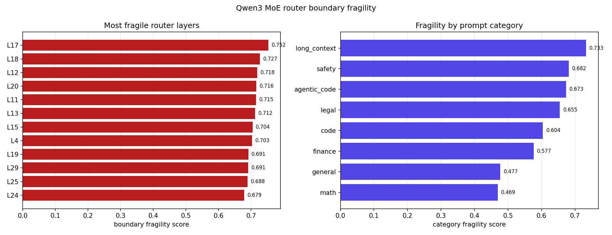

# Visualizing Model Merging：任务向量空间中的模型合并可视化

> **当前以本段为准（2026-06-20）：** Qwen3 MoE 的下一版同构 average 已经从“规则名选择”推进到可物化的 mechanistic scale law，并且这次修掉了“规则预测通过、真实写盘后还有少量 tensor 卡在阈值上方”的问题。[Qwen3 MoE Mechanistic Unified Candidate](results/qwen3_moe_mechanistic_unified_candidate/report.md) 以 `B/H/I = benefit / curvature / interference` 为每个 routed expert group 解非 base scale，选中 `s0.08_b1.65_h0.75_i0.75`，route-mass nonbase retention `0.9650`；名义 hard cap 仍是 `0.650`，但 solver 用 `0.001` materialization safety margin，把 effective cap 收紧到 `0.649`，max predicted routed relative delta 也变成 `0.6490`。它已经重新写成真实 checkpoint：`results/checkpoints/qwen3_moe_mechanistic_unified_candidate`，共 `16` 个 safetensors shard、约 `57G`；[materialized delta audit](results/qwen3_moe_mechanistic_unified_delta_audit/report.md) 直接读权重验证通过，total relative delta norm `0.238226`，routed expert FFN relative norm `0.246441`，max routed tensor relative delta `0.649063`，attention `0/288` changed，router `0/48` changed，routed tensors `>0.65` 和 `>0.6505` 都是 `0`。[mechanistic evidence audit](results/qwen3_moe_mechanistic_evidence_audit/report.md) 显示梯度/scale 方向一致率 `1.000`，局部 objective proxy 改善比例 `0.9453`，hard-cap bound groups `319`，主要压 scale 的内部信号仍是 `curvature_score`、`feature_router_instability`、`feature_expert_internal_geometry`。新的 [delta frontier](results/qwen3_moe_delta_frontier/report.md) 不只给总排名，还输出结构 pairwise distance 和 structural dominance：十个已 audit 候选里只有 `mechanistic_unified` 与 `subspace_scaled` 不是结构支配点，`unified_mechanism` 被 `subspace_scaled` 结构支配但仍保留为 mechanistic optimizer 对照。[Adaptive Eval Schedule](results/qwen3_moe_adaptive_eval_schedule/report.md) 已把这个结构支配 gate 接进调度，第一轮候选从 `5` 个扩到 `6` 个，确保两个非支配结构 frontier candidate 都进入 vLLM probe。[Feedback Optimizer](results/qwen3_moe_feedback_optimizer/report.md) 现在默认在没有 scored vLLM eval 时使用稳定的 pre-feedback `qwen3_moe_unified_mechanism_candidate` 基底，避免上一轮 mechanistic output 和 feedback prior 形成自反馈漂移；只有真实 scored eval 或显式 provisional override 才允许用 mechanistic/subspace 基底做反馈迭代。最终仍不能只按 delta safety 宣布 average 胜出；下一步必须用同一个 task manifest 跑 source endpoints 和 same-shape candidates 的 vLLM 下游评测。

> **机制 sensitivity 新增：** [Qwen3 MoE Mechanistic Sensitivity](results/qwen3_moe_mechanistic_sensitivity/report.md) 重放同一个 B/H/I solver 做 feature-family counterfactual full-score。当前 `no_category_prior` 对完整 proxy 保护最大，objective delta `0.0034`、retention delta `-0.0015`；`no_subspace_conflict` 对 scale 分布影响最大，route-mass weighted abs shift `0.0086`、`2282` groups 变化 `>0.01`；top shrink correlation 是 `feature_layer_geometry = 0.698`。这说明 unified 算法不是在套固定方法名，而是在用 category/route/geometry/subspace 信号解释哪些同构 expert 可以保留、哪些必须进 trust-region。

> **MoE router/expert 耦合新增：** [Qwen3 MoE Router-Expert Coupling](results/qwen3_moe_router_expert_coupling/report.md) 把 router top-k 边界脆弱性按 layer join 到每个 routed expert 的 mechanistic scale。结果不是“router 冻结”这么粗：fragility -> router-instability feature 的 route-mass weighted corr 是 `0.6947`，fragility -> expert scale shrink 是 `0.5831`；高脆弱层 weighted scale/shrink 是 `0.9701/0.0199`，低脆弱层是 `0.9909/0.0061`，shrink lift `0.0138`，gate 为 `router_expert_coupling_active`。这说明 router boundary 项已经在 B/H/I 里变成 expert trust-region shrink，不能在 unified average 里删掉。

> **Router-coupled candidate 新增：** [Qwen3 MoE Router-Coupled Candidate](results/qwen3_moe_router_coupled_candidate/report.md) 把上面的 coupling 机制落成 writer-ready 同构 ablation：从当前 mechanistic scale 出发，对 router-coupled risk 最高的 `972` 个 expert group 额外 shrink，max predicted delta 仍是 `0.6490`，router-coupled weighted delta 降低 `0.0011`，risk delta 降低 `0.0009`。但 nonbase retention 从 `0.9650` 降到 `0.9619`，低于 `0.965` gate，所以它被明确标成 `ablation_only_waiting_vllm`。现在它已经进入 [mechanism eval gate](results/qwen3_moe_mechanism_eval_gate/report.md)、[candidate trust gate](results/qwen3_moe_candidate_trust_region_gate/report.md) 和 [budget plan](results/qwen3_moe_eval_budget_plan/report.md) 的 `mechanism` 队列，状态是 `checkpoint_missing_until_materialized`；它只能用来检验“额外 router-boundary 保守性”是否有下游收益，不能作为默认 unified average。

> **Router-coupled retention frontier 新增：** [Qwen3 MoE Router-Coupled Retention Frontier](results/qwen3_moe_router_coupled_retention_frontier/report.md) 把上面的 direct router-boundary shrink 做成细粒度 frontier：`770` 个候选里有 `146` 个能同时过 hard cap 和 `0.965` retention gate，但最强可过 gate 的 constrained candidate 只有 `1.16e-5` router-coupled delta reduction，只达到 aggressive ablation `0.001135` 的 `1.03%`。结论是 `direct_router_boundary_term_not_default`：router fragility 应继续作为 B/H/I 里的 interference feature，而不是额外 direct shrink 默认项；真正强的 direct shrink 只能留作 ablation，等 vLLM 下游收益证明 retention trade-off 值得。

> **最新（机制驱动 unified average，2026-06）：** 见 **[Unified Average Optimizer](results/unified_average_optimizer/report.md)**、**[Qwen3 MoE Source-Set Complementarity Gate](results/qwen3_source_set_complementarity_gate/report.md)**、**[Qwen3 Average Source-Set Optimizer](results/qwen3_average_source_set_optimizer/report.md)**、**[Qwen3 MoE vLLM Eval Budget Plan](results/qwen3_moe_eval_budget_plan/report.md)**、**[Qwen3 MoE Expert Geometry Probe](results/qwen3_moe_expert_geometry_probe/report.md)**、**[Qwen3 MoE Router Calibration NLL Probe](results/qwen3_moe_router_calibration_nll_probe/report.md)**、**[Qwen3 MoE Downstream Confidence Audit](results/fp_downstream_confidence_audit/report.md)** 和 **[Qwen3 MoE Unified Mechanism Candidate](results/qwen3_moe_unified_mechanism_candidate/report.md)**。当前 unified 规则已经从 route/geometry-only 更新为 subspace-aware：Dense 仍拒绝默认 midpoint；MoE 先固定 expert identity、冻结 direct router movement，再用 route/evidence/geometry/subspace cap 生成 same-shape expert rules。Qwen3 Instruct/Coder 直线 connectivity 仍不支配 endpoint，router-only NLL probe 说明 dispatch calibration 是真实杠杆但还不是接受条件；下游生成置信审计也显示 router-cal 的 confident source-frontier wins 是 `0/3`。新增 source-set gate 把“平均前先看 source 是否互补”落成硬条件：当前 `instruct+coder` 被判为 `source_dominated_not_averageable_as_final`，dominant source 是 `instruct`，frontier avg gain 是 `0.000`，最好的 observed router-cal merge 仍比 source frontier 低 `0.069`。新增 source-set surplus optimizer 进一步把“有互补”拆成“互补是否足够覆盖已观测 merge 干扰”：当前 top source set 是 `coder+thinking`，source weights 是 `{"coder": 0.6667, "thinking": 0.3333}`，frontier avg gain 只有 `0.0083`，低于 observed merge interference budget `0.0694`，surplus `-0.0611`，所以只能进入 probe-only/endpoint 扩样，不能拿 final-average budget。新的 optimizer contract 把这些判断落成硬 gate：`13` 个 unified-average 必要条件里 `11` 个已经通过，新增通过项包括 router-coupled retention frontier gate、source-set complementarity gate 和 source-set surplus budget gate；剩下 `downstream_source_dominance_gate` 和 `final_unified_average_acceptance` 都明确卡在同一 task manifest 的 vLLM eval。因此当前可交付结果是一个已物化、已 delta-audit 的 `subspace_cap_s1.00` 同构 checkpoint，最终是否比 source endpoints 好，仍必须由同一 task manifest 下的 vLLM eval 决定。

新增 [Qwen3 MoE Expert Subspace Conflict Probe](results/qwen3_moe_expert_subspace_conflict_probe/report.md) 把 expert identity 之后的内部子空间风险也落成了 gate：它从真实 Qwen3 `18,432` 个 routed expert projection 的 channel/chunk geometry 计算 subspace conflict，发现 `1,323/6,144` 个 expert 是 high subspace-conflict，其中 `242` 个同时 route-important；当前 unified 规则已经覆盖绝大多数高风险点，只剩 `17` 个 expert 需要额外 subspace scale，物化成 ablation 后总共只减少 Coder weight `0.253078`。这个 ablation 已写成真实 same-shape checkpoint：`5,243` 条 expert tensor rules 命中 `15,729` 个 projection tensors，`48` 个 router tensors 继续 freeze，本地输出 `57G`、`16` 个 safetensors shard；[subspace-scaled delta audit](results/qwen3_moe_subspace_scaled_delta_audit/report.md) 已通过，total relative norm `0.239529`，相对当前 subspace-aware unified 额外减少 `0.000849`，routed `>0.65` 仍为 `0`。这说明下一步不是盲目整体降权，而是用 vLLM 下游评测验证这 `17` 个“同名 expert 但内部局部子空间冲突仍没被 cap 覆盖”的 expert 是否真的需要更细 shrink。

新增 [Qwen3 MoE Downstream Generation Matrix](results/fp_downstream_matrix/report.md)、[generation mechanism attribution](results/fp_downstream_attribution/report.md) 和 [confidence audit](results/fp_downstream_confidence_audit/report.md) 把机制判断放到真实生成任务上再看一次：官方 Qwen3 MoE parents 和平均候选在 MMLU/GSM8K/HumanEval 上评测后，best avg 仍是 `instruct` (`0.897`)，naive Instruct+Coder average 只有 `0.794`；只做 router calibration 后升到 `0.828`，其中 HumanEval `+0.075`、GSM8K `+0.025`。归因表进一步显示，naive average 相对 pair source frontier 的 avg drop 是 `0.103`，router-cal 只恢复其中 `0.324`，HumanEval 恢复 `0.500`，但 `0/5` 个 score 超过 pair source frontier。新的置信审计按 MMLU/GSM8K/HumanEval 的 `120/40/40` 样本量做 Wilson 区间：router-cal 对 naive 的点估计在 `2/3` 个任务为正，但 confident positive tasks 是 `0/3`，confident source-frontier wins 也是 `0/3`。这证明 router calibration 确实能恢复一部分被平均糊掉的 dispatch，但还不是 acceptance rule；它只作为“为什么 router 是 MoE 专属优化杠杆”的辅助证据，不替代最终同场 vLLM selector。

最新 [Average Method Gate Matrix](results/average_method_gate_matrix/report.md) 把常用方法族也纳入当前证据：`7` 类方法里 `0` 类默认接受，uniform/linear average 被标成 default rejected，task arithmetic / sparsity / Fisher-RegMean 类方法都只能 conditional 使用，output-space/router-KD 是 active 但仍等待 matched vLLM gate，expert alignment 和 router-aware gate 是 MoE 必要前置条件。

最新 [Average Trust-Region Bounds](results/average_trust_region_bounds/report.md) 把“为什么不能机械平均”转成可执行边界：Dense 的局部二阶/Fisher 近似在当前 Qwen pair 上实际退化比预测大 `42.86x/26.66x`，按 `5x` 误差上限反推 full task-vector λ bound 只有 `0.3416`，而 held-out path 里还能不输 endpoint 的 uniform λ 是 `0.0000`；MoE 侧 Qwen3 Instruct/Coder 和 Base/Coder source-line interior 都不支配 endpoint，direct router midpoint `λ=0.5` 是 router top-k margin safe proxy `0.0197` 的 `25.35x`，所以 router 继续 freeze。expert 侧则不同：mechanistic candidate 的 max predicted relative delta `0.6490` 正好压在 effective cap `0.6490` 内，route-mass retention `0.9650` 达标；这说明当前可动的是同构 routed expert trust-region，不是直接 source midpoint 或 router average。最终 acceptance 仍等待 locked-manifest vLLM source-dominance gate。

最新 [Average Connectivity Diagnostic](results/average_connectivity_diagnostic/report.md) 把 Dense/MoE 统一到同一组可执行判据：endpoint frontier、fixed midpoint safety、path barrier、任务互补和 local-quadratic validity。当前 `6` 个 case 里 `5` 个 path/family gate 被拒、`5` 个 fixed-midpoint gate 被拒，唯一 endpoint-frontier win 是 Dense base-anchored lambda family（endpoint gap `-0.1010`），但它同时显示固定 midpoint gap `2.8661`，所以不是接受 `0.5/0.5` average；Qwen3 MoE Instruct/Coder 直线路径 best interior 仍比 best endpoint 差 `0.1189`，这解释了为什么现在的 unified 算法必须是“允许退回 endpoint/anchor + route/expert/delta 风险门控”，而不是无条件参数平均。

最新 [Average Invariant Audit](results/average_invariant_audit/report.md) 把 Model Soups、Fisher/RegMean、TIES/DARE/DELLA/STAR、WEMoE、Expert Merging++、Sub-MoE 和 HARC 这类思路转成可执行 invariant：`10` 个 invariant 中有 `4` 个 hard gate 仍不允许直接接受 average，默认接受的方法族仍是 `0`。已经通过的是 same-shape contract、Qwen3 expert identity 和 routed delta trust-region；明确失败的是 endpoint frontier、fixed midpoint、direct router movement；router-only NLL calibration 只证明 dispatch/co-adaptation 机制存在，不能替代最终同场 vLLM dominance。结论是：所谓 unified 更稳，必须是 selector-level guarantee，即 endpoints 始终在候选集里，average 只有通过 source dominance、task regression、uncertainty 和 paired prediction gates 才会被选中。

这份仓库把 `proposal.md` 里的想法实现成了一个可运行的研究 artifact：从小型图像分类模型开始，逐步扩展到 ViT/pretrained ViT 和 Qwen 系列 LLM，观察模型合并点在任务向量空间中的位置、多个任务 basin 是否重叠，以及合并失败是否和 task-vector interference 有关。

后续 Qwen Dense/MoE 和下游微调模型的实验设计见：[Qwen Dense/MoE 下游微调模型合并实验方案](QWEN_DENSE_MOE_EXPERIMENT_PLAN.md)，结构化目标模型清单见：[Qwen Target Model Registry](results/qwen_target_model_registry/report.md)。Averaging 失败诊断、probe 清单和 MoE route-aware averaging 路线见：[Dense/MoE Model Averaging 的指标、Probe 与优化路线](MODEL_AVERAGING_PROBES_AND_MOE_OPTIMIZATION.md)。当前已有实验的同构 Average 决策汇总见：[Average Decision Report](results/average_decision_report/report.md)，probe-gated unified action plan 见：[Probe-Gated Unified Average Plan](results/probe_gated_unified_average_plan/report.md)，Dense/MoE 文献和 probe 矩阵见：[Model Averaging Literature Review](results/model_averaging_literature_review/report.md)，candidate materialization 选择见：[Average Candidate Recipes](results/average_candidate_recipes/report.md)，probe-guided dense candidate 见：[Probe-Guided Dense Average Candidate](results/probe_guided_dense_average_candidate/report.md)，dense module/norm guard ablation 见：[Qwen Dense Module-Guarded Candidate](results/qwen_dense_module_guarded_candidate/report.md)、[Qwen Dense Norm-Guarded Candidate](results/qwen_dense_norm_guarded_candidate/report.md) 和 [Qwen Dense Selective-Norm Candidate](results/qwen_dense_selective_norm_guarded_candidate/report.md)，dense sparse-method candidate 见：[Qwen Dense Sparse-Method Candidate](results/qwen_dense_sparse_method_candidate/report.md) 和 [Qwen Dense Attention Sparse-Method Candidate](results/qwen_dense_attention_sparse_method_candidate/report.md)，MoE 拓扑检查见：[Checkpoint Topology Inspect](results/checkpoint_topology_inspect/report.md)，Qwen3 MoE unified preflight 见：[Qwen3 MoE Unified Average Preflight](results/moe_unified_preflight_qwen3_30b/report.md)，Qwen3 routing gate 见：[Qwen3 MoE Routing Readiness](results/moe_routing_readiness/qwen3_30b_instruct_vs_coder/report.md)，Qwen3 expert geometry 见：[Qwen3 MoE Expert Geometry Probe](results/qwen3_moe_expert_geometry_probe/report.md)，Qwen3 route-guarded candidate 见：[Qwen3 MoE Route-Guarded Candidate](results/qwen3_moe_unified_route_guarded_candidate/report.md)，Qwen3 materialized delta audit 见：[Materialized Checkpoint Delta Audit](results/qwen3_moe_materialized_delta_audit/report.md)，Qwen3 audit-gated candidate 见：[Qwen3 MoE Audit-Gated Candidate](results/qwen3_moe_audit_gated_candidate/report.md)，Qwen3 trust-region candidate 见：[Qwen3 MoE Trust-Region Candidate](results/qwen3_moe_trust_region_candidate/report.md)，Qwen3 trust-region delta audit 见：[Qwen3 MoE Trust-Region Delta Audit](results/qwen3_moe_trust_region_delta_audit/report.md)，Qwen3 trust-region delta validation 见：[Qwen3 MoE Trust-Region Delta Validation](results/qwen3_moe_trust_region_delta_validation/report.md)，真实 MoE materialization gate 见：[MoE Materialization Pipeline Plan](results/moe_materialization_pipeline_plan/report.md)，MoE 参数组计划见：[MoE Same-Shape Average Plan](results/moe_average_plan/report.md)，MoE routing 风险诊断见：[MoE Routing Readiness](results/moe_routing_readiness/report.md)，MoE route-weight tensor rules 见：[MoE Route-Weight Recipes](results/moe_route_weight_recipes/report.md)，MoE router-bias capacity recipe 见：[MoE Router Bias Plan](results/moe_router_bias_plan/report.md)，confidence-blended router-bias recipe 见：[MoE Confidence-Blended Router Bias Plan](results/moe_confidence_blended_router_bias_plan/report.md)，confidence-blended combined writer recipe 见：[MoE Confidence-Blended Combined Recipe](results/moe_confidence_blended_combined_recipe/report.md)，combined writer 数值 smoke 见：[MoE Combined Writer Smoke](results/moe_combined_writer_smoke/report.md)，layer-wise expert remap smoke 见：[MoE Layer-Wise Expert Remap Smoke](results/moe_layerwise_expert_remap_smoke/report.md)，checkpoint materialization readiness 见：[Checkpoint Materialization Readiness](results/checkpoint_materialization_readiness/report.md)，toy MoE 验证见：[Toy MoE Route-Aware Merge](results/toy_moe_merge/report.md)，toy expert 重排写出计划见：[Toy MoE Expert Remap Plan](results/toy_moe_expert_remap_plan/report.md)，checkpoint 写出器 smoke 见：[Same-Shape Checkpoint Writer Smoke](results/same_shape_writer_smoke/report.md)。

这里说的 Average 不是 ensemble，也不是把 MoE experts 扩成更多分支；最终目标模型必须和输入模型保持同构，能用同一个 config/tokenizer/model class 直接加载。Probe 的作用是决定哪些模型、层、模块或 experts 可以被平均，以及平均系数应该怎么设。

当前最实在的 Qwen3 MoE 结果是：我已经把 route/load probe、category specialization、router fragility、真实 expert geometry、expert subspace conflict 和真实 delta audit 合成一个同构候选链。现在除了 [searched cap-law candidate](results/qwen3_moe_searched_no_gt065_delta_audit/report.md) 和 geometry-informed [layer/chunk coefficient candidate](results/qwen3_moe_layer_chunk_delta_audit/report.md)，还物化了独立的 [unified mechanism candidate](results/qwen3_moe_unified_mechanism_delta_audit/report.md) 和 [subspace-scaled ablation](results/qwen3_moe_subspace_scaled_delta_audit/report.md)。unified 在 `28` 个候选 cap/prior 里选中 `subspace_cap_s1.00`，真实 safetensors audit 通过：attention `0/288` changed、router `0/48` changed、total relative delta norm `0.240378`、routed expert FFN relative norm `0.248668`、routed `>0.65` 为 `0`。subspace-scaled 继续只在剩余局部子空间冲突 expert 上额外 shrink，audit total relative norm `0.239529`、router `0/48` changed、routed `>0.65` 为 `0`。现阶段不能提前说 unified、subspace 或 router-coupled 一定更好；真正的算法优劣还要看 Qwen3 Instruct/Coder source、`10` 个 ready-to-host same-shape candidates，以及 `1` 个等待物化的 router-coupled ablation 在同一套下游任务上的表现。

最新 [Qwen3 MoE Delta Frontier Probe](results/qwen3_moe_delta_frontier/report.md) 把十个已物化 same-shape candidates 的真实 safetensors delta 放到同一张表里。结论很明确：route-guarded -> audit-gated 主要消掉 routed expert 的危险大步长（`>1.0` 从 `182` 到 `0`，`>0.75` 从 `839` 到 `164`）；audit-gated -> trust-region 继续把 `>0.75` 从 `164` 压到 `14`；expert-only 清零 attention delta；tail-trimmed/searched/layer-chunk 逐步压 routed tail；unified mechanism candidate 把 strict routed `>0.65` 从 `89` 降到 `0`，total relative norm 是 `0.240378`；mechanistic unified 进一步把 total relative norm 降到 `0.238226`，但 max routed tensor 是 `0.649063`；subspace-scaled 保持 routed `>0.65 = 0`，并把 max routed tensor 降到 `0.623428`。新增结构支配表显示，`mechanistic_unified` 和 `subspace_scaled` 是当前两个非支配结构 frontier 点；其他候选不是“无用”，而是用来回答 attention、risk penalty、layer sensitivity、geometry-aware shrink 和 subspace-conflict shrink 这些机制问题。最终是否保留这些机制，必须交给同任务 vLLM eval 决定。

最新 [Qwen3 MoE Mechanism-Gated vLLM Eval Gate](results/qwen3_moe_mechanism_eval_gate/report.md) 已把这个问题转成可执行评测：两个 source endpoint 加 `10` 个已物化 same-shape Qwen3 MoE candidates 是 `ready_to_host`，另有 `qwen3_moe_router_coupled_candidate` 作为 `checkpoint_missing_until_materialized` 的机制消融排队。这个 gate 不再问“哪个算法名最好”，而是逐项检验 tail delta cap、route/load trust-region、shared attention ablation、0.65 tail trim、risk penalty simplification、layer/chunk sensitivity、unified mechanism optimizer、subspace conflict ablation、router-coupled boundary ablation 和 endpoint fallback；如果所有 average 候选被 source 支配，selection rule 会返回同构 endpoint/no-average。当前本机 `nvidia-smi` 不可用，所以 selection 状态是 `awaiting_remote_vllm_eval`。

最新 [Qwen3 MoE vLLM Eval Budget Plan](results/qwen3_moe_eval_budget_plan/report.md) 把“正当评测要跑多少”和“先跑哪些”都落成脚本：原 gate 的 `64` examples 只保留为 audit floor，预算版 `run_eval_budget.sh` 会把 `--max-examples` 提到 `384`；但默认请求已经从全量 ablation 改成 `final`，只跑两个 source endpoint 加两个 candidate trust-region gate 允许进入最终选择的候选：`qwen3_moe_mechanistic_unified_candidate` 和 `qwen3_moe_subspace_scaled_candidate`。这 4 个 final-core 方法的 recommended prompt budget 是 `6,144`；另外 `9` 个候选留在 `mechanism` 队列，recommended prompt budget `13,824`，其中 `8` 个已 ready-to-host，`qwen3_moe_router_coupled_candidate` 需要先物化和 delta audit；router calibration 的 active `cap001`/`margin_profile` 仍是 `2` 个 pending materialization。`384` 这个数来自两个约束：binary task score 的 95% Wilson half-width 要压到 `0.05` 以内需要 `381` 条，四舍五入到 `384`；paired prediction gate 若要在 alpha `0.05` 下看出约 `5pp` 的净 source advantage，按 `25%` discordance 估计需要约 `248` 条 shared examples。因此下一轮远端 vLLM 不是静态 smoke，也不会默认把 GPU 浪费在已经被 final selector 排除的 ablation-only 候选上；HumanEval 受 `164` 条数据上限限制，selector 会按实际落盘样本数计算区间。

最新 [Qwen3 MoE Adaptive Eval Schedule](results/qwen3_moe_adaptive_eval_schedule/report.md) 不再只靠手写候选顺序排队，而是把 mechanism coverage、真实 safetensors delta frontier 和 structural dominance 合成调度优先级：source controls 仍必须先跑，第一轮候选 probe 是 `6` 个、覆盖 `6` 个机制问题；结构分数最高的是 `qwen3_moe_mechanistic_unified_candidate`，score `0.993`，原因是 total relative delta `0.238226`、routed relative delta `0.246441`、max routed tensor `0.649063`、routed `>0.65` 为 `0` 且 attention/router freeze。`subspace_scaled` 现在也进入第一轮 probe，因为它和 mechanistic unified 是当前两个非支配结构 frontier 点，能直接检验 uncovered subspace-conflict shrink 是否应该成为 unified 默认机制。

新增 [Qwen3 MoE Eval Task Manifest Preflight](results/qwen3_moe_eval_manifest_preflight/report.md) 把 paired prediction 的输入条件也提前检查：预算表中 `15/15` 个 planned rows 已对齐到 `results/qwen3_moe_mechanism_eval_gate/task_manifest.json`，现在这个 canonical manifest 已经写出，preflight 状态是 `task_manifest_ready`、任务充分性 `4/4`、总样本 `1316/1316`。manifest 覆盖 GSM8K `384`、HumanEval compile `164`、MMLU `384`、safety `384`；其中 safety 从 BeaverTails 采样时加了 obvious label-contradiction filter，保持 `192/192` safe/unsafe 平衡，避免明显 unsafe prompt 被放进 non-refusal 侧。后续每个 vLLM eval bundle 都必须带同一个 `task_manifest_sha256`，否则 paired prediction gate 会拒绝选择。

最新 [Qwen3 MoE Mechanism Leverage Map](results/qwen3_moe_mechanism_levers/report.md) 把现有 probe 结果转成“下一步该优化什么”的优先级：`source_and_candidate_downstream_eval` 排第一（`0.98`），因为没有同场 vLLM 分数就不能接受 average；`router_direct_movement` 排第二（`0.94`），因为 router move gate 是 `0/48` 层允许、min top1 agreement 只有 `0.069`；`routed_expert_tail_cap_0_75`、`risk_penalty_complexity`、`tail_cap_0_65` 和 `route_load_trust_region` 依次排在后面。它现在把真实 expert geometry 也纳入 importance-guided layer/chunk calibration：高敏感层更新为 `12,13,17,20,21,22,23,26`，top geometry layer 是 `17`、route-geometry risk `0.714`；低敏感层继续共享粗粒度 coefficients。这对应近期 MoE merging/Expert Merging 里“层和 expert 敏感性不均匀”的机制，但仍保持 same-shape writer 约束。

最新 [Qwen3 MoE Expert Geometry Probe](results/qwen3_moe_expert_geometry_probe/report.md) 是这轮新增的“读内部参数”实验：它直接从 Qwen3-30B-A3B Instruct/Coder safetensors 读取 `18,432` 个 routed expert projection tensor（`6,144` experts, `48` layers），计算 `gate_proj/up_proj/down_proj` 的 cosine、relative delta、channel chunk delta，并和已有 route/load context join。结果显示 mean/p05 projection cosine 为 `0.386/0.118`，mean/p95 relative delta 为 `1.062/1.275`；`931` 个 expert 是 high internal-geometry-risk，`204` 个 expert 同时有 route+geometry 风险。top route-geometry expert 是 layer `13`, expert `104`，risk `0.930`。这说明 Qwen3 Instruct/Coder 即使 expert identity 通过，也不能用一个全局系数解释所有 expert；内部几何必须进入 cap-law 或 layer/chunk coefficient。

最新 [Qwen3 MoE Layer/Chunk Coefficient Candidate](results/qwen3_moe_layer_chunk_candidate/report.md) 已经把上面的 layer/chunk 机制判断落成同构 writer rules，而不是停在文档层面。选中的 schedule 是 `policy_095_098_100`：geometry-informed 高敏感层 `12,13,17,20,21,22,23,26` 的 Coder contribution 乘 `0.95`，中等敏感 two-layer chunks 乘 `0.98`，低敏感层保持 `1.0`；它在 retention `>=0.975` 和 max relative delta `<=0.65` 约束下，保留 route-mass weighted Coder contribution `0.9851`，风险加权 delta proxy 降低 `0.0207`。现在它已经物化成真实 same-shape checkpoint，写出 `16` 个 safetensors shards，delta audit 通过：`18,867` tensors 同构、`10,353` 个 routed expert FFN tensors 改动、attention/norm/embedding/router 全部不动，total relative delta norm `0.243`，routed max relative delta `0.65003`，strict `>0.65` 为 `89` 且 `>0.6505` 为 `0`。这个结果说明 layer/chunk sensitivity 已进入真实候选集合；它能不能优于 source 或 searched cap-law 仍必须由同场 vLLM 决定。

最新 [Qwen3 MoE Unified Result Selector](results/qwen3_moe_unified_result_selection/report.md) 单独处理“什么时候真正接受 unified average”：它要求两个 source endpoints 和 `qwen3_moe_unified_mechanism_candidate` 完成同一套 vLLM 下游评测、candidate audit 通过、没有任务分数跌破两个 source、没有被任一 source endpoint 支配，并且 avg 或 worst source frontier 有增益。当前状态是 `awaiting_source_eval`，也就是还不能声称 average 更好；[selector smoke](results/qwen3_moe_unified_result_selection_smoke/report.md) 覆盖了 candidate-win、source-dominance、task-regression 和 no-gain 四种分支，`4/4` 通过。

最新 [Qwen3 MoE Final Candidate Selector](results/qwen3_moe_final_candidate_selection/report.md) 把选择范围扩展到全部 `11` 个 same-shape Qwen3 MoE candidates，并和两个 source endpoint 做同场比较。规则是：source endpoints 必须先通过 eval-bundle audit；candidate 必须通过 vLLM bundle audit、checkpoint audit 和 [candidate trust-region gate](results/qwen3_moe_candidate_trust_region_gate/report.md)；如果被任一 source 在可用 score 上支配、某个任务跌破两个 source、Wilson score confidence gate 下仍可能低于 source 下界，或在同一批 prediction 样本上以 exact paired sign-test 显著净丢给 source，就不能选。当前真实状态是 `awaiting_source_eval`、`0/11` candidate usable；候选级 trust-region gate 把 `2/11` 标成最终可选，只有 `qwen3_moe_mechanistic_unified_candidate` 和 `qwen3_moe_subspace_scaled_candidate` 同时满足 router/attention freeze、strict routed tail cap 和结构 frontier，其他 `9` 个保留为机制 ablation。[selector smoke](results/qwen3_moe_final_candidate_selection_smoke/report.md) 覆盖 candidate-win、source-dominance、task-regression、small-sample uncertainty、significant paired-prediction regression、noisy paired delta、structural tie-band、confidence-separated point leader、partial/provisional selection 和 trust-region gate，`11/11` 通过。separated point-leader case 明确保证：只有候选和点估计领先者的置信区间重叠时，structural frontier/safety 才能参与 tie-break；如果下游分数已经统计分离，结构指标不能翻盘。

最新 [Qwen3 MoE vLLM Eval Bundle Audit](results/qwen3_moe_eval_bundle_audit/report.md) 又在 selector 前加了一层结果包校验：每个 source/candidate 的 `summary.json`、`eval_plan.csv`、`metrics.csv`、`model_summary.csv` 和 `predictions.csv` 必须存在，模型名必须和 gate 计划一致，四个任务必须齐全，每任务都有 primary score；现在它读取预算表里的可达样本数，硬性要求 GSM8K/MMLU/safety `384`、HumanEval compile `164`，不再允许旧的 `64` 条 smoke 结果进入 selector。此外还检查 `task_manifest_sha256` 和 paired prediction key，防止不同 candidate 偷偷用了不同样本或不可配对预测。当前真实状态是 `awaiting_eval`、`0/13` 个 eval bundle 可用于选择；[audit smoke](results/qwen3_moe_eval_bundle_audit_smoke/report.md) 覆盖 valid、stale-model、missing-task、low-example、key-mismatch 和 manifest-mismatch 六种情况，`6/6` 通过。

最新 [Qwen3 MoE Mechanism Effect Attribution](results/qwen3_moe_mechanism_effect_attribution/report.md) 把 source frontier -> route-guarded -> audit-gated -> trust-region -> expert-only -> tail-trimmed -> searched cap-law -> layer/chunk -> unified mechanism -> mechanistic unified / subspace-scaled ablation 拆成相邻机制对比。它现在只输出 structural delta，因为 vLLM eval bundle 还没通过 audit；真实状态是 `awaiting_eval`、`0/10` 个 transition 已评分。当前结构链条显示：audit-gated 消掉 routed `>0.75` 的 `675` 个 tensor，trust-region 再消掉 `150` 个，expert-only 清零 `288` 个 attention changed tensors，tail-trimmed 再消掉剩余 `14` 个 routed `>0.75` tensor，geometry-informed layer/chunk 相比 searched cap-law 又把 strict `>0.65` 从 `245` 降到 `89`，unified mechanism 再把 `>0.65` 从 `89` 降到 `0`，mechanistic unified 与 subspace-scaled ablation 则等待验证更细的 scale law / 局部子空间冲突 shrink 是否有行为收益。后续一旦 vLLM 分数落盘，它会自动给出每一步对 avg/worst/task score 的影响，而不是只给最终排名。

最新 [Qwen3 MoE Post-Eval Refresh](results/qwen3_moe_post_eval_refresh/report.md) 把远端 vLLM eval 之后必须跑的步骤固定成一条命令：candidate trust-region gate、eval budget planner、eval bundle audit、unified selector、final candidate selector、mechanism attribution、feedback optimizer、mechanistic unified candidate、mechanistic evidence audit、mechanistic sensitivity attribution、router-expert coupling attribution、router-coupled ablation candidate、router-coupled retention frontier、source-set complementarity gate、average source-set optimizer、unified average optimizer、average method gate matrix、average trust-region bounds、mechanism leverage map、十个 smoke 和 `collect_results`。当前本地刷新链路 `30/30` 步通过，真实状态仍是 audit `0/13` usable、unified selector `awaiting_source_eval`、final selector `awaiting_source_eval`、attribution `0/10` scored；candidate trust-region gate 是 `candidate_trust_region_gate_ready`，`2/11` final-selectable、`9/11` ablation-only；eval budget 默认队列是 `final`，4 个 final-core 方法、`6,144` prompt budget，机制消融 `9` 个候选被单独放进 mechanism-ablation 队列，router calibration 仍等待 materialization；mechanistic sensitivity 已刷新到 `mechanistic_sensitivity_ready`，objective 侧最大反事实退化是 `no_category_prior` (`0.0034`)，scale 侧最大扰动是 `no_subspace_conflict` (`0.0086`)；router-expert coupling gate 是 `router_expert_coupling_active`，fragility->feature/shrink corr 是 `0.6947/0.5831`；router-coupled candidate 是 `ablation_only_waiting_vllm`，retention delta `-0.0031`、coupled delta reduction `0.0011`；retention frontier 进一步给出 `direct_router_boundary_term_not_default`，默认 gate 内最强 direct shrink 只有 aggressive ablation `1.03%` 的 proxy effect；source-set complementarity 进一步给出 `source_dominated_not_averageable_as_final`，说明当前 `instruct+coder` average 不应被期待超过 dominant `instruct`，只能先作为 repair/ablation；source-set surplus optimizer 找到 top `coder+thinking`，但 `0.0083` frontier gain 低于 `0.0694` interference budget，surplus `-0.0611`，因此只能 probe-only，不能直接进 final-average budget；unified average optimizer 已刷新到 `built_waiting_for_qwen3_vllm_eval`，下一实验仍是 `budgeted_qwen3_moe_downstream_eval`，命令是 `results/qwen3_moe_eval_budget_plan/run_eval_budget.sh final`；ledger smoke `5/5` 通过，method gate consistency smoke `5/5` 通过，eval budget queue smoke `11/11` 通过，trust-region bounds 是 `2/7/2` passed/rejected/waiting，trust-region smoke `11/11` 通过。feedback optimizer 现在默认在无 scored vLLM eval 时回到稳定的 `qwen3_moe_unified_mechanism_candidate` 基底，避免上一轮 mechanistic output 和 feedback prior 形成自反馈漂移；只有显式打开 provisional override 才会用上一轮 mechanistic/subspace 作为反馈基底。[plan-only report](results/qwen3_moe_post_eval_refresh_plan/report.md) 也写出了远端可复制的命令清单。

最新 [Qwen3 MoE Router Move Gate](results/qwen3_moe_router_move_gate/report.md) 把“router 要不要也平均”单独拿出来测了：它读取真实 Qwen3 routing readiness 和 Instruct/Coder router tensor delta，结论是直接 router weight movement 应被拒绝。48 层没有任何一层在全部观察场景里通过 all-category guard；`493/576` 个 readiness rows 要求 `calibrate_router_before_average`，另有 `6` 个要求 freeze/check load；source router 总 relative delta norm 是 `0.739`，top-k Jaccard mean/min 是 `0.454/0.242`，top1 agreement min 只有 `0.069`。所以 unified MoE 默认继续 freeze router；如果要动 router，下一步必须是 route-KD/HARC-style calibration 后重新 probe，而不是直接线性平均 router weights。

最新 [Qwen3 MoE Router Margin Fragility](results/qwen3_moe_router_margin_fragility/report.md) 进一步把 router 问题拆到 top-k 边界：用真实 route probe 的 `top1_margin_mean`、top-k Jaccard、top1 agreement 和 router relative delta norm 给 48 层排序。结果是 `24/48` 层属于 high-fragility，最脆弱层是 `L17`（score `0.752`），最脆弱 category 是 `long_context`（score `0.733`），min safe-lambda proxy 只有 `0.0197`。这说明 MoE router 不是普通 Dense 参数：即使很小的 router 位移，也可能跨过离散 top-k dispatch 边界，把 token 发给另一组 expert；所以 direct router average 应继续冻结，router 只能作为单独校准 intervention 进入候选。



最新 [Qwen3 MoE Router Calibration NLL Probe](results/qwen3_moe_router_calibration_nll_probe/report.md)、[MoE Router Delta Calibration Smoke](results/moe_router_delta_calibration_smoke/report.md) 和 [Qwen3 MoE Router Calibration Selection](results/qwen3_moe_router_calibration_selection/report.md) 把这一步变成了可执行 gate。真实 30B probe 先做 Instruct/Coder 50/50 MoE linear merge，再只训练 `mlp.gate.weight`，experts 全冻结：worst-NLL `2.6355 -> 2.4140`，avg-NLL `1.5754 -> 1.4145`，code NLL `0.5154 -> 0.4149` 且比两个 source 都低。这证明 router dispatch/co-adaptation 是实际可优化的剩余误差来源；但 general/worst 仍未支配 best source，所以 selector 不会直接接受它。route-KD router delta 训练会同时记录真实 token assignment 的 hard top-1/top-k expert load，而 selector 不再只看 KL 或 downstream 分数，还要求 router-only audit、relative-norm cap、top-k margin safe-lambda、source/baseline vLLM 对照、hard capacity overflow 和 train-vs-validation gap 同时通过；当前 margin safe-lambda proxy 是 `0.0197`，全局 `0.01/0.025/0.05` 三个 router cap 只有 `0.01` 计划通过，`0.025/0.05` 只能作为显式 ablation target 跑。训练器现在还支持 per-router cap table；新增 `margin_profile` candidate 会把 48 层的 safe-lambda proxy 转成逐层 cap table，范围是 `0.0201-0.0500`，因此不会被全局最脆弱层的 `0.0197` 把所有层一起卡死。`run_all` 默认执行 `cap001` 和 `margin_profile`，selector 则逐 router tensor 检查 cap table violation。训练器现在默认用 held-out validation cache 做 capacity-aware best-epoch selection，而不是在训练 cache 上盲目选最后一步；直接 trainer smoke 已改成两个 synthetic router 的 cap-table 验证，分别给 `0.02/0.08` 相对范数上限，使用 `307/77` train/validation row split，validation KL 从 `0.2392` 降到 `0.2153`、top1 agreement 从 `0.4481` 升到 `0.4870`，hard top1 overflow `0.0122 -> 0.0122`、hard top-k overflow `0.0000 -> 0.0000`，max cap utilization 是 `1.0000` 且没有 cap violation。这说明逐层/逐 router cap-table projection 已经被 smoke 覆盖，不只是一个全局 cap 标量。更接近真实 forward probe 的 [router calibration cache smoke](results/moe_router_calibration_cache_smoke/report.md) 现在会把 prompt/batch group 整组留出：每个 router 有 `4` 个 groups，训练/验证按 `3/1` groups 分开，验证 rows 是 `24`，selection split 是 `group_validation`；这比 token 行随机切分更能暴露跨 prompt 泛化。新的 [router calibration job](results/qwen3_moe_router_calibration_job/report.md) 会在任何 source、baseline 或 candidate eval 前先生成同一个 `task_manifest.json`，所有 vLLM eval 都必须写入相同 `task_manifest_sha256`；selector 也新增 manifest gate，缺失或 mismatch 会拒绝 candidate，[selector matrix smoke](results/qwen3_moe_router_calibration_selector_matrix_smoke/report.md) 已覆盖 manifest-mismatch 负例并 `6/6` 通过。真实 Qwen3 selector 仍是 `awaiting_baseline_eval`，也就是不会在 source endpoint 和 frozen-router baseline 的 vLLM eval 缺失时提前接受 router calibration。

最新 [Qwen3 MoE Trust-Region Cap-Law Search](results/qwen3_moe_trust_region_cap_search/report.md) 又把 trust-region 规则本身做了一次内部优化搜索：在 `5,243` 个真实 expert groups 上搜索 `432` 个可解释 cap law，指标是“降低高 relative-delta routed experts，同时保留 route-mass-weighted Coder contribution”。结果反而提醒我们要简化：当前手写 risk penalties 的 retention 是 `0.9818`，仍有 `129` 个 group 高于 `0.65`；简单 uniform `0.65` cap 的 retention 是 `0.9823`，高于当前规则且 `>0.65` groups 为 `0`。这不是下游性能结论，但说明当前复杂 risk penalty 在 delta-threshold 上不够高效，下一轮 vLLM 应重点比较 expert-only / tail-trimmed / 简化 cap law。

最新 Dense 机制结果：我用真实 Qwen2.5-0.5B Instruct/Coder 权重跑了一个 [Dense Curvature-Displacement Probe](results/fp_curvature_law/report.md)，直接比较 diagonal-Fisher 二阶预测和真实 A->B interpolation loss。uniform midpoint 的 general NLL 从 `3.099` 升到 `5.911`，code NLL 从 `0.515` 升到 `1.747`；但 Fisher 二阶预测的 degradation 只有 `0.0656/0.0462`，真实 degradation 是 `2.812/1.232`，actual/predicted ratio 分别是 `42.86` 和 `26.66`。这说明当前 Qwen instruct/coder midpoint 不是一个局部小凸二次问题，而是明显跨了非局部 barrier；Fisher merge 的 worst NLL `5.249` 虽然比 uniform `5.911` 好，但仍在高 loss 区域。因此 Dense 侧统一规则也不能是“直接 Fisher/直接 0.5 平均”，而要先用 path/eval probe 判断 barrier，再做 coefficient、layer 或 tensor gate。

最新 unified Dense selector 结果：我把 linear average、task arithmetic、sign-elect、magnitude-weighted merge 写进同一个候选族 `base + lambda * combine(delta_A, delta_B)`，再用 held-out worst-task NLL 选择，结果见 [Unified Merge Family Probe](results/fp_merge_compare_dense/report.md)。在 Qwen2.5-0.5B Instruct/Coder/Base 的小样本 probe 上，selector 选中的是 `lambda=0.0`，也就是拒绝吸收两个 task delta，退回 base anchor；test worst NLL 是 `5.183`，略差于 best endpoint `5.151`，但明显好于 linear midpoint `8.948` 和 TIES baseline `9.110`。这不是“已经找到超过所有端点的平均模型”，而是机制上很关键：unified 方法必须允许输出“不合并/少合并”，否则就会被 midpoint ridge 和错误的 sparse conflict rule 拖坏。

最新 Dense 生成式 smoke 结果：我又把同一组 Qwen2.5-0.5B 模型放到一个安全的 exact-answer generation eval 上，结果见 [Generation Exact-Answer Merge Eval](results/fp_gen_eval_dense/report.md)。这个 smoke 不下载数据集，也不执行模型生成的代码，只问 2 个 math exact-answer 和 2 个 code-output exact-answer。linear midpoint 的 avg/worst accuracy 是 `0.000/0.000`，直接崩掉；unified `lambda=0` 是 `0.500/0.000`，和 base/instruct 类似，至少避免了 midpoint 生成退化；coder 是 `0.500/0.500`，在这个极小切片上 worst 最好。这个结果没有证明 unified 已经赢过 endpoint，反而说明 selector 还需要把生成式 held-out gate 纳入选择，否则只靠 NLL 会倾向保守退回 anchor。

最新第一性原理 MoE 机制 probe：我把一个训练好的 B 模型做了函数等价的 expert/router row 置换，B 的输出几乎不变（probe MSE `7.66e-16`），但同名 expert index 的语义被打乱。结果见 [MoE Average Mechanism Probe](results/fp_moe_mechanism/report.md)：same-name uniform average 的 worst-domain MSE 是 `0.5105`；用 expert-output cosine + Hungarian 恢复语义对齐后降到 `0.1252`；再只校准 router 降到 `0.1095`。相反，aligned Fisher 在这个设置里升到 `0.1520`，说明 curvature/Fisher 不是无条件更好，必须经过 held-out gate。这个实验给 unified average 的形式一个机制解释：MoE 必须先对齐 expert identity，再决定 expert 权重，router 只能在 experts 已经对齐后小步校准或蒸馏；不能指望 router 单独修掉错配 experts，也不能机械套 Fisher/TIES。

最新真实 MoE 反事实：我把 [Real MoE Expert-Gauge Self-Merge Probe](results/fp_moe_real_probe/report.md) 跑在 `allenai/OLMoE-1B-7B-0924-Instruct` 上。这个模型是 packed MoE：`16` 层、每层 `64` experts。同步置换 expert slices 和 router rows 后，NLL 基本不变（`4.1678 -> 4.1656`），说明置换确实函数等价；但把原模型和这个等价模型按同名 tensor average，NLL 直接升到 `9.6588`；恢复 expert permutation 后 average 回到 `4.1678`，`16/16` 层精确恢复。这是真实 MoE LLM 上的证据：即使两个 checkpoint 表示同一个函数，只要 expert gauge 不一致，同名 average 也会失败。同目录下的 Qwen3 Instruct/Coder cross-correspondence 显示官方这对模型 `48/48` 层 identity-optimal，mean diagonal cosine `0.183`、off-diagonal `0.00014`；所以这对 Qwen3 可以先用 identity mapping，但 expert-alignment gate 不能删。

最新 MoE selector 结果：我把真实 OLMoE gauge 反事实、Qwen3 Instruct/Coder expert correspondence、Qwen3 真实 route/load probe 和 toy MoE route/capacity selector 合成了 [MoE Probe-Gated Selector](results/moe_probe_gated_selector/report.md)。当前规则是：全局上 `reject_same_name_average_without_alignment`，因为 OLMoE 同名 average 的 NLL degradation 是 `5.491`，aligned degradation 是 `0.000`；对 Qwen3 这对官方同族模型，expert identity gate 通过，因为 identity-optimal layers 是 `1.000`、argmax identity 是 `1.000`、diag/offdiag cosine ratio 约 `1339.5`；同构 preflight 也通过。但真实 routing readiness 显示直接 router average 高风险，selector 决策已变成 `reject_direct_router_average_calibrate_or_freeze`，下一步 blocker 是 `materialized_route_guarded_candidate_vllm_eval`。也就是说，Qwen3 experts 可以先按 identity 对齐，但 router 必须 freeze/小步校准/route-KD 或做 capacity correction，不能直接平均。

最新 Qwen3 MoE unified preflight：我把 [Qwen3 MoE Unified Average Preflight](results/moe_unified_preflight_qwen3_30b/report.md) 跑在本地缓存的 `Qwen3-30B-A3B-Instruct-2507` 和 `Qwen3-Coder-30B-A3B-Instruct` 上，只读 config 和 safetensors header，不加载 30B 权重内容。结果是同构合同通过：`48` 层、每层 `128` experts、top-k `8`、`48` 个 router tensor 全部同形，`18,432` 个 routed expert tensor layout 全部匹配；前面的 expert correspondence 也通过 identity gate。这个结果把 unified 方法的边界收窄了：Qwen3 这对模型不再卡在结构或 expert identity；后续真实 routing probe 已经补上，剩下的关键问题是 route/load 决策是否能在下游 eval 中保住源模型能力。

最新 Qwen3 MoE 真实 routing probe：`results/moe_routing_probe/qwen3_30b_instruct_vs_coder` 已经完成 `12` 个 prompts、`8` 类场景、`48` 个 router 的 route overlap 和 expert load 捕获；[Qwen3 MoE Routing Readiness](results/moe_routing_readiness/qwen3_30b_instruct_vs_coder/report.md) 给出的状态是 `high_risk_calibrate_router_before_merge`。关键数字是：top-k Jaccard mean/min 为 `0.454/0.242`，top1 agreement mean/min 为 `0.413/0.069`；`576` 个 router/prompt slice 中，`493` 个要求 `calibrate_router_before_average`，只有 `31` 个直接通过 small-lambda gate，另有 `6` 个因 load concentration 建议 freeze/check load balance。expert load 侧有 `4,459` 行 high-load expert 需要保护或 source-weight 处理。这个结果解释了为什么 unified MoE 不能只靠 expert identity：expert index 对齐解决的是 gauge，route overlap 和 load 才决定 router 能不能动。

最新 Qwen3 MoE route-guarded candidate：我把上面的真实 route/load probe 转成 [Qwen3 MoE Route-Guarded Candidate](results/qwen3_moe_unified_route_guarded_candidate/report.md)，并已在本地物化成 same-shape checkpoint `results/checkpoints/qwen3_moe_unified_route_guarded_candidate`（57G，本地忽略，不进 git）。这个候选 base 选 Instruct，本地 Coder 只作为 source delta；router 先 `--freeze-router`，shared attention 只给 coder 一个 `0.25` 小步长，expert FFN 按真实来源模型的 route mass 生成 source-route-conditioned tensor rules。结果是 `5,243` 个 expert 规则、`35,432` 行 route mass 被使用、`73,728` 行不属于目标 source/category 的路由被跳过；真实写出 `16` 个 safetensors shard 和 `model.safetensors.index.json`，header 检查显示输出 `18,867` 个 tensor 与 base 完全同名、同 shape、同 dtype。这个 candidate 还不是最终答案；下一步必须在 GPU/vLLM host 上跑下游任务，并和两个 source endpoint 对照。

最新 Qwen3 MoE materialized delta audit：我新增 [Materialized Checkpoint Delta Audit](results/qwen3_moe_materialized_delta_audit/report.md)，直接读取已物化 safetensors，而不是只看 writer manifest。结果是 `passed`：输出 checkpoint 的 `18,867` 个 tensor 同构，实际改变 `10,641` 个 tensor、约 `56.3%` 参数量，总 relative delta norm `0.286`；关键是 `48/48` 个 router tensor 全部未变，embedding/head 和 norm 也未变。改动集中在 `10,353/18,432` 个 routed expert FFN tensor（relative delta norm `0.293`）和全部 `288` 个 attention tensor（relative delta norm `0.189`）。这验证了当前 candidate 的机制确实是“冻结 router、保护结构、只在 source-route-conditioned experts 和小步 attention 上移动”。

最新 Qwen3 MoE audit-gated candidate：基于上面的真实 delta audit，我新增 [Qwen3 MoE Audit-Gated Candidate](results/qwen3_moe_audit_gated_candidate/report.md)，并已物化成 `results/checkpoints/qwen3_moe_audit_gated_candidate`（57G，本地忽略）。它保留 route-frequency expert rule，但对实际 FFN relative delta norm 超过 `0.75` 的 expert 按比例缩小非 base source（Coder）delta weight；`5,243` 个 expert rules 中 `302` 个被缩小，mean effective nonbase weight 从 `0.201` 降到 `0.193`，最大 audited relative delta 原本是 `1.327`，最强缩放系数是 `0.565`。新的 [audit-gated delta audit](results/qwen3_moe_audit_gated_delta_audit/report.md) 证明这个约束已经进入真实 safetensors：总 relative delta norm 从 `0.286` 降到 `0.264`，routed expert FFN relative delta norm 从 `0.293` 降到 `0.270`，routed expert 单 tensor 最大 relative delta 从 `1.327` 降到 `0.750`，`>1.0` 的 routed tensors 从 `182` 降到 `0`；router 仍是 `0/48` 改动。这个候选是更保守的下一版，不替代 vLLM eval；它的作用是把“probe 发现少数 expert 移动过大”转成可物化的规则。

最新 Qwen3 MoE trust-region candidate：我新增 [Qwen3 MoE Trust-Region Candidate](results/qwen3_moe_trust_region_candidate/report.md)，把 route/load readiness、category specialization、router fragility 和 materialized delta audit 合成同一个 expert-level trust region。它不是统一套一个 `0.75` cap，而是对高负载 expert、shared/mixed expert、fragile-router layer、低 route 证据和 category/source mismatch 分别降低 target cap，只缩小非 base source（Coder）delta，router 仍冻结。结果是 `5,243` 个 expert rules 中 `405` 个被缩小，其中 `103` 个不是因为 delta 已超过 `0.75`，而是被 MoE 内部风险信号额外触发；mean effective nonbase weight 从 `0.201` 降到 `0.186`。它已物化成 `results/checkpoints/qwen3_moe_trust_region_candidate`（57G，本地忽略），真实 Qwen3 writer manifest 显示 `18,867` 个 floating tensors，expert/attention/router hits 分别是 `15,729/288/48`。新的 [trust-region delta audit](results/qwen3_moe_trust_region_delta_audit/report.md) 证明约束进入真实 safetensors：总 relative delta norm `0.249`，routed expert FFN relative delta norm `0.255`，routed tensor 最大 relative delta `0.750`，`>1.0` 为 `0`、`>0.75` 为 `14`、`>0.65` 为 `366`；router 仍是 `0/48` 改动。新的 [trust-region delta validation](results/qwen3_moe_trust_region_delta_validation/report.md) 进一步逐 tensor 对齐预测和真实 audit：max abs relative-delta prediction error 只有 `0.000093`，P99 是 `0.000007`，没有 tensor 超过 `0.002` tolerance；那 `14` 个略高于 `0.75` 的 routed tensors 全在 `0.751` rounding slop 内。下一步是 vLLM 下游评测。

最新 MoE 机制结果：toy MoE 上，失败主因不是“平均”这个动作本身，而是 expert 语义 index、router dispatch 和 expert load capacity 一起漂移。旧的 `unified_moe_average` 先用 per-expert source weight search 处理 expert 语义/重要性，再对 router seed 和 capacity loss 系数做 held-out selection sweep；它的 soft worst accuracy 是 `0.785`，hard top-2 worst accuracy 是 `0.690`，max top-k overflow 是 `0.0775`。单独把 expert seed 换成 route-conditioned output-space projection 后，`unified_output_projection_moe_average` 的 soft worst accuracy 升到 `0.795`、overflow 降到 `0.0700`，但 hard top-2 worst accuracy 降到 `0.685`，说明 projection 在 soft 输出空间有用，但会在某些 sparse expert 上过度移动。新的 `unified_confidence_blended_moe_average` 用 output-space projection 的 `captured_fraction` 当 expert-level 置信度：projection 能解释该 expert 输出残差时更信 projection 权重，解释不了时退回 calibration search 权重。结果是 soft worst accuracy `0.790`、hard top-2 worst accuracy `0.690`、max top-k overflow `0.07625`，即在不损失旧 unified hard sparse 分数的情况下提升 soft 分数并略降 overflow。严格 capacity-aware sparse 下，`unified_moe_bias_capacity_average` 仍是当前推荐：hard top-2 worst accuracy `0.6825`、max top-k overflow `0.0475`、`accuracy - overflow = 0.635`。这些机制已经落到 checkpoint recipe：router bias 用 `scripts/build_moe_router_bias_plan.py` 生成 `tensor,index,delta`；旧 unified 和 confidence-blended unified 都有 writer-ready router-bias plan；expert-search、output-projection 和 confidence-blended expert 权重分别写成 [searched expert tensor rules](results/toy_moe_expert_weight_recipes/report.md)、[output-projection expert tensor rules](results/toy_moe_output_projection_recipes/report.md) 和 [confidence-blended expert tensor rules](results/toy_moe_confidence_blended_recipes/report.md)。新的 [combined writer recipe](results/moe_confidence_blended_combined_recipe/report.md) 把 5 条 tensor rule、4 条 expert alias rule 和 4 行 router-bias delta 合成同一个 same-shape writer command；[combined writer smoke](results/moe_combined_writer_smoke/report.md) 已用 swapped experts 数值验证 alias、expert rule、freeze-router 和 bias delta 能在一次写出里同时生效。

这个结果也解释了为什么不能只机械套一个低-overflow router：`unified_router_kd_seed_average` 把 Router-KD router 直接接到 expert-search 权重上后，hard top-2 code accuracy 只有 `0.5975`，说明 router prior 和 expert 权重必须共同校准。output-space projection probe 的 mean captured fraction 是 `0.616`；`expert_output_projection_router_calibrated_average` soft worst accuracy 达到 `0.8075`，是当前 soft-router 最优，但 hard top-2 worst accuracy 只有 `0.6475`。confidence blend 后，expert 0/3 因 captured fraction 高而主要采用 projection 权重，expert 1/2 因 captured fraction 低而更多回退到 search 权重；这就是它能支配旧 unified seed、但不假装支配所有 Pareto 点的原因。

最新真实 vLLM source-vs-merge 结果：本地已把 Qwen2.5-0.5B base、Qwen2.5-0.5B-Instruct、Qwen2.5-Coder-0.5B-Instruct 和 materialized `qwen_0_5b_instruct_coder_uniform_average` 都用 vLLM host，并在 GSM8K、MMLU、safety、HumanEval compile 各 `64` 个样本上跑完同一套下游评测。结果见 [Qwen Source-vs-Merge vLLM Comparison](results/vllm_source_merge_comparison/report.md)：base avg primary `0.375`、instruct `0.227`、coder `0.199`、uniform average `0.180`，uniform average 在 4 个模型里排第 4，低于最佳源模型 `0.195`。逐任务看，它比最佳源模型分别低 GSM8K `0.094`、MMLU `0.125`、safety `0.047`、HumanEval compile `0.609`；safety 的 `0.500` 也不是好现象，因为 safe non-refusal 是 `1.000`，unsafe refusal 是 `0.000`，相当于几乎不拒绝 unsafe prompts。这说明 0.5/0.5 Dense uniform average 不只是 probe 上可疑，真实 endpoint 对照下也被三个源模型同时支配；下一步应做 probe-guided same-shape average，而不是继续盲目平均。

最新 probe-guided dense average 结果：基于 Qwen instruct/coder NLL grid，脚本选择了同构 bridge candidate `qwen_0_5b_probe_guided_bridge_a025_b100`，即 `alpha=0.25,beta=1.0`，不是端点复制，也不是 `0.5/0.5`。NLL probe 上它相对 uniform midpoint 的 worst NLL 降低 `1.921`、avg NLL 降低 `2.551`；写出 checkpoint 后真实 vLLM eval 得到 avg primary `0.203`，比 uniform `0.180` 高 `0.023`，GSM8K 从 `0.000` 到 `0.062`，MMLU 从 `0.219` 到 `0.250`，unsafe refusal 从 `0.000` 到 `0.500`。但它仍低于 best source `0.375`，HumanEval compile 仍是 `0.000`。结论是：global scalar coefficient 已经能验证“避开 midpoint ridge”这个机理，但还不够；下一步要做 layer/module-wise weighting，而不是继续调一个全局数字。

最新 module-wise dense ablation 结果：Qwen instruct/coder 的 task-vector 冲突不是均匀分布的，`norm_anchor` 虽然只有 `43,904` 个参数，但 mean tensor cosine 是 `-0.164`、sign conflict 约 `0.441`，说明 layernorm/最终 norm 的尺度方向在两个微调源之间有明显反向成分。直接把这个 probe 机械地扩展成“冻结 embedding/norm、阻尼 MLP”的 `qwen_0_5b_module_guarded_bridge` 反而变差，真实 vLLM avg primary 从 global bridge 的 `0.203` 降到 `0.160`；只冻结全部 norm 的 `qwen_0_5b_norm_guarded_bridge` 与 global bridge 打平为 `0.203`，但任务分布改变：GSM8K/MMLU 分别低 `0.016/0.031`，safety 高 `0.047`；只冻结 6 个极端 post-attention norm 的 `qwen_0_5b_selective_norm_guarded_bridge` 也没有变好，avg primary 是 `0.191`。结论是：module conflict probe 有诊断价值，但 action 必须窄化并做 ablation；当前证据说明 norm 尺度效应更像全局耦合，不是“找到几个最高冲突 tensor 冻住”就能解决。

最新 dense sparse-method candidate 结果：新的 sparse-coordinate 实验不再问“哪个场景套哪个算法”，而是把机制拆到坐标级。`qwen_0_5b_sparse_method_bridge` 沿用 global bridge 的 `instruct=0.25,coder=1.0`，再从 Qwen instruct/coder 的 tensor conflict probe 中选出 sign conflict `>=0.44`、delta cosine `<=0.16`、参数量 `>=100k` 的 attention/MLP tensor，对这些 tensor 执行 TIES-style coordinate trim/sign-elect/merge。它选中 `99` 个 tensor、覆盖约 `48.73%` 参数，真实 vLLM avg primary 是 `0.156`，比 global bridge 低 `0.047`，说明对 MLP 大范围做 TIES 会破坏能力。收窄后的 `qwen_0_5b_attention_sparse_method_bridge` 只选 attention tensor：`49` 个 tensor、覆盖约 `4.62%` 参数，真实 vLLM avg primary 是 `0.203`，与 global bridge 打平、比 uniform 高 `0.023`；任务分布是 safety 高 `0.062`，GSM8K/MMLU 分别低 `0.047/0.016`。当前机制结论是：global coefficient 负责避开 midpoint ridge，coordinate conflict rule 不能粗暴作用到 MLP 语义容量；attention-only 是更安全的窄 intervention，但还没有支配 global bridge。

## 一屏版结论

如果只想先看结果，可以先读这几条：

1. **Digits 是最干净的正例。** 低 worst-loss 区域沿着两个任务都能接受的 valley 展开，base、linear average、best grid 都在这个 valley 附近；两个 expert endpoint 各自只擅长一个任务，所以在 worst-loss 图上反而是高处。
2. **CIFAR-10 是 naive average 失败例。** linear average 没有落到最好的共同区域，validation grid best 明显更靠近低 worst-loss 区域；这说明 merge coefficient 不能总用 `0.5,0.5`。
3. **Pretrained ViT transfer 是“model soup 直觉”更成立的例子。** shared low-loss basin 更宽，linear average 已经不错，grid best 还能略好一点。
4. **Qwen instruct/coder multi-expert 是最值得警惕的例子。** `alpha=0.5,beta=0.5` 的 linear average 落在高 worst-NLL ridge 上；instruct endpoint / best 比平均好得多，说明 LLM expert merge 不能只做朴素平均。
5. **不是所有有效方法都真的在这个二维 plane 上。** base、expert、linear average、task arithmetic、grid point 是 raw task-vector plane 里的点；RegMean、layer-wise task arithmetic 这类方法可能离开这个 plane。展示图里这类点用 `projected` 标记，表示它们只是投影到 `alpha,beta` 平面上看位置。
6. **这些图看起来有些凸，不是理论假设。** 这只是当前 same-base task-vector slice 和 worst-loss/NLL 指标在选定范围内的形状。Li et al. 那类 loss-landscape 图用的是随机或 filter-normalized 方向，目标是展示局部训练地形；这里的方向是任务语义方向，回答的是 merge 几何，所以图形不必长得一样。
7. **Average 决策现在由 probe 输出驱动。** [Average Decision Report](results/average_decision_report/report.md) 把 merge grid、conflict probe 和可选 MoE routing probe 汇总成同构 checkpoint 的权重建议；当前 Qwen instruct/coder 被标成 `avoid_uniform_average`，建议先做 connectivity/barrier 筛选再重学平均权重。
8. **Dense/MoE 文献矩阵已经转成工程规则。** [Model Averaging Literature Review](results/model_averaging_literature_review/report.md) 整理了 `22` 篇 Dense averaging、task-vector、conflict-aware merge、output-space projection、MoE routing/expert merging 相关来源，并映射成 `7` 类方法、`7` 类 probe 和 `7` 个 MoE 优化 gate。
9. **Qwen 目标模型已经落成 registry。** [Qwen Target Model Registry](results/qwen_target_model_registry/report.md) 现在列出 `17` 个候选条目：dense `12`、MoE `5`；其中包含官方 Qwen 分支、DeepSeek/AM 等第三方下游模型、DianJin/Long1K 论文候选和下游 adapter/finetune 候选池。第一轮建议先跑 `Qwen2.5-7B-Instruct + Coder + Math + DeepSeek-R1-Distill-Qwen-7B`。
10. **MoE 不能把 router/expert 当普通 dense 层平均。** [MoE Same-Shape Average Plan](results/moe_average_plan/report.md) 把 router、shared modules、expert FFN、embedding/lm_head 和 LoRA/adapters 分开：默认先冻结/校准 router，experts 先按 route frequency/output similarity 匹配，再写回同 expert 数的 checkpoint。
11. **同构 checkpoint 写出路径已经打通。** `scripts/write_same_shape_average_checkpoint.py` 会先验证 tensor name/shape，再按 `base + sum_i w_i * (source_i - base)` 写 safetensors；现在支持 `--tensor-method-rule` 对高 sign-conflict tensor 做 TIES-style coordinate trim/sign-elect/merge，支持 `--tensor-add-csv` 写 router-bias scalar delta，也支持 `--packed-expert-rule-csv` 对 Qwen-style packed expert tensor 的第 0 维做 slice-level source expert remap/weight。Qwen2.5-0.5B base/instruct/coder dry-run 已检查 `290` 个 tensor 无缺失、无 shape mismatch；本地还已写出 `qwen_0_5b_instruct_coder_uniform_average` 这个 0.5/0.5 Dense 负 baseline checkpoint，用于验证真实 host/eval 管线。writer smoke 现在覆盖 Dense sparse method、freeze-router、bias additive correction、展开式 expert alias 和 packed expert slice rule。
12. **MoE 大模型先做 header/config probe。** [Checkpoint Topology Inspect](results/checkpoint_topology_inspect/report.md) 已对本地完整 `Qwen3.6-35B-A3B` safetensors 做 header-only 拓扑检查，不加载 67G 权重内容：`qwen3_5_moe`、`40` 层、`256` experts、每 token 激活 `8` 个，active fraction `0.03125`；真实权重里 routed experts 是 packed tensor 形式，`82` 个 `routed_expert` tensors、`66,035,122,176` bytes，router 是 `41` 个 tensors。这说明 expert remap 不能再假设 `experts.17.*` 这种展开式名字；[MoE Packed-Expert Writer Smoke](results/moe_packed_expert_writer_smoke/report.md) 已验证保持 tensor 名字/shape 不变时，能对 packed expert 第一维写入 matched source expert slice。
13. **不是每个 best grid 都值得写 checkpoint。** [Average Candidate Recipes](results/average_candidate_recipes/report.md) 明确把当前 Qwen instruct/coder best grid 标成 `skip_endpoint_only`，因为 `alpha=1,beta=0` 只是端点，不是有价值的 average；`0.5/0.5` uniform average 也被 probe 标成负 baseline。
14. **Qwen3 MoE route-aware average 已落到真实 tensor-rule 文件。** [Qwen3 MoE Route-Guarded Candidate](results/qwen3_moe_unified_route_guarded_candidate/report.md) 用真实 Instruct/Coder route/load probe 生成 `5,243` 个 expert 规则；writer dry-run 已在真实 Qwen3 safetensors 上命中 `15,729` 个 expert FFN tensor、`288` 个 attention tensor，并冻结 `48` 个 router tensor。它不是扩 expert，也不是 ensemble，输出 checkpoint 仍保持原结构。
15. **真实 MoE routing probe CLI 已经跑过 Qwen3。** `scripts/probe_moe_routing.py` 会捕获 MoE router hook，输出 `router_summary.csv`、`expert_load.csv`、可选 `route_overlap.csv`，并额外写 `summary.json` 和 `report.md`；[Qwen3 MoE Routing Readiness](results/moe_routing_readiness/qwen3_30b_instruct_vs_coder/report.md) 已分析真实 `12` prompts / `48` routers，结论是 direct router average 高风险，必须 freeze、校准或 route-KD 后再进入 vLLM eval。
16. **MoE router 先过 readiness gate。** [MoE Routing Readiness](results/moe_routing_readiness/report.md) 会把 `router_summary.csv`、`route_overlap.csv`、`expert_load.csv` 转成 collapse、route drift、top-k 边界脆弱性和 expert load 风险；只有这些风险可控，才考虑开放 router 小 λ 或生成 expert-wise tensor rules。
17. **Toy MoE 已经复现 expert-index mismatch 和 router 漂移风险。** [Toy MoE Route-Aware Merge](results/toy_moe_merge/report.md) 中，直接 all-weight average 的 worst accuracy 是 `0.545`，expert-matched average 是 `0.750`，route-aware expert average 是 `0.750`；`unified_moe_average` 的 soft/hard top-2/max-overflow 是 `0.785/0.690/0.0775`；`unified_output_projection_moe_average` 是 `0.795/0.685/0.0700`；新的 `unified_confidence_blended_moe_average` 是 `0.790/0.690/0.07625`，说明 captured-fraction-gated expert 权重能在不损失 hard top-2 的情况下改善旧 unified。bias-only capacity 修正把 max top-k overflow 降到 `0.0475`，capacity-aware score 达到 `0.635`。
18. **同一个 readiness gate 已能分析多方法 MoE probe。** [Toy MoE Routing Readiness](results/toy_moe_routing_readiness/report.md) 把 toy MoE 的 base、endpoint、all-weight、expert-matched、route-aware 方法分开诊断；其中 `all_weight_average` 的 general slice 触发 `calibrate_router_before_average`，而 expert-matched/route-aware 的 route overlap 接近 `1.0`。
19. **MoE 方法选择已从“读表”变成自动决策。** [Toy MoE Method Selection](results/toy_moe_method_selection/report.md) 把 worst accuracy、routing readiness、hard top-2 dispatch 和 capacity overflow 合在一起：`all_weight_average` 被判为 `reject_routing_breakdown`；soft dispatch 下推荐 `expert_output_projection_router_calibrated_average`；sparse hard top-2 推荐 `unified_confidence_blended_route_kd_seed_average`；严格 capacity-aware sparse 推荐 `unified_moe_bias_capacity_average`，并把 confidence-blended unified、output-projection unified、bias-capacity unified 和 Router-KD 留在 hard top-2 / overflow Pareto frontier。
20. **Expert matching 已能进入 checkpoint materialization。** [Toy MoE Expert Remap Plan](results/toy_moe_expert_remap_plan/report.md) 把 expert-output matching 转成 `source_tensor_aliases.txt`：输出 checkpoint 的 expert index、tensor name 和 shape 不变，只改变某个 source 读取哪个 matched expert tensor；当前 toy 的 4 个 global alias rule 全部 ready，最小 output cosine 为 `0.943`。[MoE Layer-Wise Expert Remap Smoke](results/moe_layerwise_expert_remap_smoke/report.md) 进一步验证真实多层 MoE 可生成 layer-scoped alias，避免某一层的 expert 匹配被错误应用到所有层。
21. **Router-bias capacity correction 已落成 recipe。** [MoE Router Bias Plan](results/moe_router_bias_plan/report.md) 用 per prompt/category 的 worst top-k load 生成 writer-ready `router_bias_deltas.csv`；toy `unified_moe_average` 上 expert 0 的 worst top-k fraction 是 `0.3900`，高于 capacity `0.3125`，因此生成 `-0.0530` 的 bias delta，其余 experts 做中心化补偿。[MoE Confidence-Blended Router Bias Plan](results/moe_confidence_blended_router_bias_plan/report.md) 对 `unified_confidence_blended_moe_average` 生成同结构 bias delta：expert 0 的 worst top-k fraction 是 `0.38875`，delta 为 `-0.05230`；expert 3 load 偏低，delta 为 `+0.04469`。[MoE Confidence-Blended Combined Recipe](results/moe_confidence_blended_combined_recipe/report.md) 已把 confidence-blended expert 权重、expert alias remap 和 router-bias delta 合成一条 writer command。真实 Qwen checkpoint 若没有对应 bias tensor，writer 会在校验阶段报错，而不是改变模型结构。
22. **vLLM 下游评测 harness 已通过 mock 和真实 endpoint。** [vLLM Downstream Eval Contract Smoke](results/vllm_downstream_eval_smoke/smoke_report.md) 验证 HTTP contract；[Materialized Checkpoint vLLM Eval](results/vllm_checkpoint_eval/qwen_0_5b_instruct_coder_uniform_average/report.md) 是真实 vLLM-hosted checkpoint 评测；[Qwen Source-vs-Merge vLLM Comparison](results/vllm_source_merge_comparison/report.md) 把三个源模型 endpoint 和 uniform-average checkpoint 放到同一套下游任务里比较。
23. **Dense uniform average 的真实下游表现是负结果。** `qwen_0_5b_instruct_coder_uniform_average` 在每任务 `64` 样本上得到 GSM8K `0.000`、MMLU `0.219`、safety `0.500`、HumanEval compile `0.000`，avg primary `0.180`、worst primary `0.000`；同场 source endpoint 里 base/instruct/coder 的 avg primary 分别是 `0.375/0.227/0.199`，所以 uniform average 被三个源模型同时支配。这和前面 Qwen multi-expert plane 里 `0.5/0.5` 高 NLL ridge 一致。
24. **Probe-guided dense average 已跑真实 eval。** [Probe-Guided Dense Average Candidate](results/probe_guided_dense_average_candidate/report.md) 从 NLL grid 选出 `alpha=0.25,beta=1.0` bridge，写成同构 checkpoint，并用 vLLM 跑完同一套下游任务；它比 uniform avg primary 高 `0.023`，但仍比 best source 低 `0.172`，所以只能作为进入 layer/module-wise average 的证据。
25. **Module-wise guard 是负结果，norm-only/selective-norm 给出机制边界。** [Qwen Dense Module-Guarded Candidate](results/qwen_dense_module_guarded_candidate/report.md) 的 avg primary 是 `0.160`，比 global bridge 低 `0.043`；[Qwen Dense Norm-Guarded Candidate](results/qwen_dense_norm_guarded_candidate/report.md) 的 avg primary 与 global bridge 同为 `0.203`，但 safety 上升、GSM8K/MMLU 下降；[Qwen Dense Selective-Norm Candidate](results/qwen_dense_selective_norm_guarded_candidate/report.md) 只冻结 6 个极端 norm tensor 后 avg primary 是 `0.191`。这个结果说明 probe 的作用是定位机理和指导更窄的 intervention，而不是把高冲突模块一刀切冻结。
26. **Sparse-coordinate candidate 已跑真实 vLLM eval，给出机制边界。** [Qwen Dense Sparse-Method Candidate](results/qwen_dense_sparse_method_candidate/report.md) 对 attention+MLP 的 broad TIES 规则得到 avg primary `0.156`，低于 global bridge `0.047`；[Qwen Dense Attention Sparse-Method Candidate](results/qwen_dense_attention_sparse_method_candidate/report.md) 只动 attention 后 avg primary `0.203`，与 global bridge 打平、比 uniform 高 `0.023`。这说明 sparse coordinate merge 不能粗暴覆盖 MLP，下一步应学习 tensor/density gate，而不是扩大规则范围。
27. **真实 Qwen MoE 已从 gate 推进到九个本地 checkpoint、九份文件级 delta audit、逐 tensor trust-region validation、真实 expert geometry probe，以及 subspace-aware unified candidate。** 当前真正进展见 [Checkpoint Materialization Readiness](results/checkpoint_materialization_readiness/report.md)、[Qwen3 MoE Expert Geometry Probe](results/qwen3_moe_expert_geometry_probe/report.md)、[Materialized Checkpoint Delta Audit](results/qwen3_moe_materialized_delta_audit/report.md)、[Qwen3 MoE Audit-Gated Candidate](results/qwen3_moe_audit_gated_candidate/report.md)、[audit-gated delta audit](results/qwen3_moe_audit_gated_delta_audit/report.md)、[Qwen3 MoE Trust-Region Candidate](results/qwen3_moe_trust_region_candidate/report.md)、[trust-region delta audit](results/qwen3_moe_trust_region_delta_audit/report.md)、[trust-region delta validation](results/qwen3_moe_trust_region_delta_validation/report.md)、[expert-only attention ablation](results/qwen3_moe_expert_only_trust_region_candidate/report.md)、[expert-only delta audit](results/qwen3_moe_expert_only_delta_audit/report.md)、[tail-trimmed expert-only candidate](results/qwen3_moe_tail_trimmed_expert_only_candidate/report.md)、[tail-trimmed delta audit](results/qwen3_moe_tail_trimmed_delta_audit/report.md)、[searched cap-law delta audit](results/qwen3_moe_searched_no_gt065_delta_audit/report.md)、[layer/chunk delta audit](results/qwen3_moe_layer_chunk_delta_audit/report.md)、[unified mechanism delta audit](results/qwen3_moe_unified_mechanism_delta_audit/report.md)、[subspace-scaled delta audit](results/qwen3_moe_subspace_scaled_delta_audit/report.md) 和 [expert subspace conflict probe](results/qwen3_moe_expert_subspace_conflict_probe/report.md)：`qwen3_moe_unified_route_guarded_candidate`、`qwen3_moe_audit_gated_candidate`、`qwen3_moe_trust_region_candidate`、`qwen3_moe_expert_only_trust_region_candidate`、`qwen3_moe_tail_trimmed_expert_only_candidate`、`qwen3_moe_searched_no_gt065_max_retention_candidate`、`qwen3_moe_layer_chunk_candidate`、`qwen3_moe_unified_mechanism_candidate` 和 `qwen3_moe_subspace_scaled_candidate` 都已物化成本地 `16` shard / `18,867` tensor 同构 checkpoint。trust-region candidate 把 routing/load/category/delta probe 联合成 expert-level cap，缩小 `405/5,243` 个 expert rules；expert geometry probe 读取 `18,432` 个真实 routed expert projection tensor，找出 `204` 个 route+geometry high-risk experts；当前 unified mechanism optimizer 把 route/evidence/geometry/subspace risk 放进同一个 retention-constrained 目标，选中 `subspace_cap_s1.00`。实际 audit 显示 tail-trimmed/searched/layer-chunk/unified/subspace 的 total relative delta norm 分别是 `0.243/0.248/0.243/0.240378/0.239529`，unified 和 subspace 的 routed `>0.65` 都为 `0`，attention/router 仍是 `0` changed。下一步是 vLLM 下游评测。
28. **Probe-gated unified average 已把“为什么”转成 action gate。** [Probe-Gated Unified Average Plan](results/probe_gated_unified_average_plan/report.md) 不是按场景静态排名方法，而是从已有 vLLM ablation 和 toy MoE 机制对比里提炼默认动作：Dense 侧只保留 `probe_guided_global_bridge_only`，因为 global bridge 比 uniform avg primary 高 `0.023`，而 aggressive module guard 低 `0.043`；MoE 侧默认组合是 expert identity alignment、confidence-blended expert weights、guarded router calibration 和 capacity gate，其中 expert identity matching 的 soft worst-acc gain 是 `0.205`，capacity bias 的 top-k overflow delta 是 `-0.029`。Qwen3 这对 MoE 的 topology、identity 和 routing probe 已经通过必要 gate，并已落成本地 materialized route-guarded candidate。
29. **Unified selector 的第一个真实 Qwen Dense 结果是“拒绝坏合并”。** [Unified Merge Family Probe](results/fp_merge_compare_dense/report.md) 在同一个候选族里比较 linear、task arithmetic、sign-elect 和 magnitude-weighted variants，held-out 选择 `lambda=0.0`；test worst NLL `5.183`，比 linear midpoint 好 `3.765`，比 TIES baseline 好 `3.927`，但仍比 best endpoint 差 `0.032`。结论是现在不能宣称 Dense average 已经支配 endpoint；正确动作是让 selector 有权退回 anchor/endpoint，再扩展到 layer/module-wise 或真实 vLLM selection。
30. **生成式 smoke 复现了 midpoint 坏掉，但也暴露了 NLL selector 的保守性。** [Generation Exact-Answer Merge Eval](results/fp_gen_eval_dense/report.md) 中，linear midpoint 在 2 个 math + 2 个 code-output exact-answer 题上 avg/worst 都是 `0.000`；unified `lambda=0` 是 `0.500/0.000`，避免了 midpoint 崩坏；coder 是 `0.500/0.500`，说明小样本生成式 gate 会更偏向 endpoint。下一步 selector 必须同时看 NLL 和 generation held-out，而不是只看一个 probe。
31. **MoE selector 现在明确区分 expert identity gate 和 router/load gate。** [MoE Probe-Gated Selector](results/moe_probe_gated_selector/report.md) 输出全局规则 `reject_same_name_average_without_alignment`；Qwen3 Instruct/Coder 通过 expert identity gate，可先用 identity mapping；新的 [Qwen3 MoE Unified Average Preflight](results/moe_unified_preflight_qwen3_30b/report.md) 进一步确认这对模型同构合同通过：`48` 个 router tensor 和 `18,432` 个 routed expert tensor layout 匹配。但真实 [Qwen3 MoE Routing Readiness](results/moe_routing_readiness/qwen3_30b_instruct_vs_coder/report.md) 显示 router 不能直接平均：`493/576` 个 router/prompt slice 要求先校准，top-k Jaccard mean/min 只有 `0.454/0.242`；新的 [Qwen3 MoE Router Move Gate](results/qwen3_moe_router_move_gate/report.md) 进一步按 layer 聚合后发现 `0/48` 层允许小步 router delta。新的 [Qwen3 MoE Route-Guarded Candidate](results/qwen3_moe_unified_route_guarded_candidate/report.md) 已把这个判断落成冻结 router + source-route-conditioned expert weights，并已写成可由 vLLM 加载的本地同构 checkpoint。下一步不再是写更多 plan，而是在 GPU host 上对两个 source endpoint 和这些 candidates 做同一套下游评测。
32. **Checkpoint materialization readiness 已推进到九个 Qwen3 checkpoint candidates 可评测。** [vLLM Checkpoint Eval Plan](results/vllm_checkpoint_eval_plan/report.md) 显示 Qwen3 Instruct source、Qwen3 Coder source、九个已物化 Qwen3 MoE candidates 和 0.5B baseline 都是 `ready_to_host`；`qwen3_moe_subspace_scaled_candidate` 已指向本地 `results/checkpoints/qwen3_moe_subspace_scaled_candidate`，并通过同构 delta audit。其中 `qwen3_moe_unified_mechanism_candidate` 指向独立 checkpoint `results/checkpoints/qwen3_moe_unified_mechanism_candidate`，不再复用 searched no-gt-0.65。最新 [Unified Result Selector](results/qwen3_moe_unified_result_selection/report.md) 仍是 `awaiting_source_eval`，所以现在不会提前宣布 average 胜出。

核心对象是：

```text
theta(alpha, beta) = theta_0 + alpha * tau_A + beta * tau_B
tau_i = theta_i - theta_0
```

这里的 `alpha,beta` 是两个任务向量的合并系数。我们在这个平面上评估每个点的 task A / task B loss、accuracy、worst-task 指标，并把常见合并方法投影回同一个空间。

## 怎么读这些图

图里的符号含义如下：

- `alpha`：沿着 expert A task vector 走多远。`alpha=1,beta=0` 通常就是 expert A。
- `beta`：沿着 expert B task vector 走多远。`alpha=0,beta=1` 通常就是 expert B。
- 左侧 2D contour map：同一个 `alpha,beta` 网格的俯视图，颜色和等高线表示 `worst_loss` 或 `worst_nll`。颜色越低、等高线数值越低，表示两个任务中最差的那个也更好。
- 右侧 3D surface：同一份网格数据的 3D 表达。`x/y` 还是 `alpha/beta`，`z` 是 loss 或 NLL。它不是另一个平面，也不是额外的数据。
- 图上的实心点：base、两个 expert、linear average、best grid 等具体 checkpoint 或 merge 点，它们严格位于 raw task-vector plane。
- 图上的空心 `projected` 点：方法本身不在这个 raw plane 上，但可以把它投影回 `alpha,beta` 平面看相对位置。Digits 图里的 RegMean 就是这种情况。
- 2D 和 3D 是同一数据的两种读法：2D 更适合看点的位置和等 loss 线，3D 更适合直观看 basin、ridge、valley 的形状。

## 先回答：为什么这里说 2D，而不是早期论文那种 3D 图？

这其实不是矛盾。

早期 loss-landscape 文章里常见的 3D 图，本质上也是一个二维切片：

```text
x 轴 = 方向 1 的系数
y 轴 = 方向 2 的系数
z 轴 = loss
```

也就是说，3D surface 展示的是“二维参数平面上的标量函数”。本项目里的 merge landscape 也是同一类对象，只是二维平面的两个方向不是随机扰动方向，而是有语义的任务向量 `tau_A` 和 `tau_B`。README 里的展示图现在同时给出 2D contour 和 3D surface：前者负责精确读点和等高线，后者负责看几何形状。

所以更准确的说法是：

- 研究空间是二维任务向量平面 `alpha,beta`；
- 可视化形式可以是 2D heatmap/contour，也可以是 3D surface；
- 3D surface 的 z 轴通常是 `worst_loss` 或 `worst_nll`；
- 2D 图更适合精确比较和交互，3D 图更接近经典 loss-landscape 论文的视觉风格；
- 如果要复现 Li et al. 的 [Visualizing the Loss Landscape of Neural Nets](https://arxiv.org/abs/1712.09913) 那类更“崎岖/非凸”的视觉效果，应当另外取随机或 filter-normalized directions；这会回答“某个模型附近 loss landscape 长什么样”，而不是“两个 task vector 的 merge 几何长什么样”。

下面这些展示图左侧是 2D contour map，右侧是同一数据的 3D surface。


## 结论摘要

当前 coverage audit：`complete = 84`, `partial = 1`, `missing = 0`；唯一 partial 是 generic target-registry vLLM eval 还没有跑完，但 materialized checkpoint、source-vs-merge 对照、probe-guided dense candidate、dense guard ablation 的真实 vLLM eval、真实 Qwen3 MoE materialized checkpoint、expert geometry probe，以及 probe-gated/unified average selection gate 都已完成。完整汇总见 `results/summary.md` 和 `results/summary.json`。

主要结论：

1. 合并是否成功，确实可以用“是否落在多个任务共同可接受的 basin 交集附近”来解释。
2. 小模型上，线性平均、task arithmetic、TIES/DARE/Fisher 等 on-plane 方法可以直接放到同一个任务向量平面中比较；RegMean、layer-wise task arithmetic 等 off-plane 方法需要标成投影点或单独报告。
3. 单类 expert surrogate 是一个负结果：十个 digit expert 的多数 pair 很容易 merge，global conflict 指标对 drop 的预测很弱，说明 interference 不能只看全局统计。
4. 独立随机初始化会制造表面上的 interpolation barrier；简单 hidden-unit alignment 后，loss barrier 从 `0.064` 降到 `0.006`。
5. CIFAR-10 和 CIFAR100/ViT 证明这个方法不是只适用于 toy MLP。
6. pretrained ViT-B/16 frozen-backbone transfer 提供了更接近大规模视觉模型的证据：linear average worst accuracy `0.763`，grid best `0.783`。
7. Qwen2.5-1.5B base-to-instruct 路径上，`lambda=0.75` 在多个 slice 上表现稳定，MMLU 小切片达到 `18/24 = 0.750`。
8. Qwen2.5-0.5B instruct+coder multi-expert merge 显示，简单平均会明显退化：linear average avg/worst NLL 为 `5.591 / 9.553`，而 instruct endpoint avg NLL 为 `3.009`。
9. Qwen2.5-0.5B instruct/coder 的 materialized `0.5/0.5` Dense uniform average 已用 vLLM 跑完真实下游评测，avg primary 只有 `0.180`，worst primary 为 `0.000`，因此它只能作为负 baseline。

## 研究覆盖

| 模块 | 状态 | 证据 |
| --- | --- | --- |
| 2D/3D task-vector merge landscape | 完成 | digits、CIFAR、pretrained ViT、Qwen multi-expert 均有网格和图 |
| per-task basin overlay | 完成 | digits basin overlay |
| lambda sweep | 完成 | digits、CIFAR、Qwen path |
| method overlay | 完成 | average、task arithmetic、SLERP、TIES、DARE、TIES+DARE、Fisher、RegMean、layer-wise task arithmetic、grid search |
| interference atlas | 完成 | digits、CIFAR、single-digit pairwise |
| one-class expert surrogate | 完成 | 10 个 single-digit expert，45 个 pair |
| randomness / alignment | 完成 | 独立初始化 MLP 对齐前后 barrier |
| natural image | 完成 | CIFAR-10 vehicle/animal |
| ViT / pretrained ViT | 完成 | CIFAR100 ViT-style 与 ImageNet-pretrained ViT-B/16 frozen-backbone transfer |
| Qwen LLM path | 完成 | Qwen2.5-1.5B base-to-instruct |
| Qwen benchmark slices | 完成 | GSM8K、MMLU、HumanEval NLL、BeaverTails safety/refusal |
| Qwen multi-expert | 完成 | Qwen2.5-0.5B base + instruct + coder |
| Qwen dense sparse-coordinate candidate | 完成 | broad attention+MLP 和 attention-only TIES sparse rule 均已 materialize 并完成 vLLM eval |
| Dense/MoE averaging literature matrix | 完成 | 22 个来源被整理成方法、probe、MoE 优化 gate 和 writer action，并补入 output-space / sparse capacity gate |
| Qwen target model registry | 完成 | 17 个 Qwen 官方/第三方/下游候选映射到场景、评测、probe 和同构拓扑 gate |
| MoE routing probe CLI | 完成 | 真实 MoE router hook probe 已实现，能写 router/expert/overlap CSV 与 summary/report |
| MoE routing probe smoke | 完成 | tiny MoE 本地验证捕获 2 个 router、6 行 route overlap |
| Toy MoE expert remap materialization | 完成 | expert-output matching 已转成 source tensor alias rules，保持输出 checkpoint 同构 |
| dashboard | 完成 | `results/dashboard/index.html` |

## 1. Controlled Digits：最干净的 merge-plane demo

设置：先训练一个共享 MLP base，再从同一个 base fine-tune 两个 expert：digits `0-4` 和 digits `5-9`。这个实验便宜、可控，适合密集评估 `41 x 41` 的 `alpha,beta` 网格。

关键数字：

| 指标 | 数值 |
| --- | ---: |
| linear average worst accuracy | `0.922` |
| layer-wise task arithmetic worst accuracy | `0.928` |
| RegMean linear-layer worst accuracy | `0.939` |
| grid max worst accuracy | `0.961` |
| global task-vector cosine | `0.138` |

3D worst-loss surface：


2D merge landscape：


per-task basin overlay：


method overlay：


lambda sweep：


interference atlas：


解释：digits 是这个项目最接近“hero figure”的部分。展示图里 base、两个 expert、linear average 和 best grid 是 raw task-vector plane 里的点；RegMean 用空心 `projected` 标记，因为它的 `plane_residual` 较大。好的 on-plane merge 点通常靠近两个任务都能接受的区域，而不是只靠近某一个 expert。RegMean 表现更好，但它主要是 off-plane 改进，不能简单解释成“在这个二维平面上移动到了更好位置”。

## 2. One-Class Expert Surrogate：一个 expert 只学一个类

设置：训练 10 个 single-digit expert，每个 expert 只强化一个 digit class，然后评估全部 45 个 pair 的 merge。

关键数字：

| 指标 | 数值 |
| --- | ---: |
| mean linear worst accuracy | `0.986` |
| 最差 pair | `3/9` |
| weighted conflict vs drop Spearman | `0.165` |

pairwise heatmaps：


conflict vs merge drop：


layer conflict atlas：


解释：这个实验很重要，因为它不是只给正结果。多数 single-digit pair 可以被线性平均保留下来，global sign conflict / weighted conflict 对 drop 的预测并不强。这说明“冲突导致 merge 失败”不是一句简单的全局统计结论，layer-local、task-specific 的结构更重要。

## 3. Randomness / Alignment：随机初始化会制造假 barrier

设置：训练两个相同任务但不同随机初始化的小 MLP，比较 hidden-unit permutation alignment 前后的 interpolation path。

关键数字：

| 指标 | 对齐前 | 对齐后 |
| --- | ---: | ---: |
| midpoint accuracy | `0.944` | `0.971` |
| loss barrier | `0.064` | `0.006` |


解释：如果两个模型不是从同一个 base fine-tune 出来的，权重空间里的 barrier 可能只是神经元排列对不上造成的。alignment 后 barrier 大幅下降，支持 proposal 里关于 Git Re-Basin / permutation symmetry 的担忧。

## 4. CIFAR-10 Vehicle / Animal：自然图像上的失败案例

设置：训练一个小 GroupNorm CNN base，再 fine-tune vehicle expert 和 animal expert。

关键数字：

| 指标 | 数值 |
| --- | ---: |
| base worst accuracy | `0.376` |
| linear average worst accuracy | `0.249` |
| validation-grid best worst accuracy | `0.426` |

3D worst-loss surface：


2D merge landscape：


method overlay：


lambda sweep：


interference atlas：


解释：CIFAR-10 是更真实的自然图像分类案例，naive average 的 worst accuracy 低于 base，说明不是所有 same-base expert 都能被简单 soup。grid search 找到更好的 worst-task 区域，支持“合并系数应该由 basin overlap 指导”。

## 5. CIFAR100 ViT-Style：从 CNN 扩展到 transformer 视觉模型

设置：训练一个小 patch-transformer 做 CIFAR100 coarse-label 分类，再 fine-tune living/object 两个 expert。

关键数字：

| 指标 | 数值 |
| --- | ---: |
| base worst accuracy | `0.189` |
| linear average worst accuracy | `0.076` |
| best method worst accuracy | `0.197` |
| global task-vector cosine | `-0.176` |

merge landscape：


method overlay：


lambda sweep：


task-vector PCA：


interference atlas：


解释：from-scratch ViT-style 模型的绝对性能不高，但它验证了同一套 task-vector plane、method overlay、lambda sweep、PCA geometry 和 interference atlas 能迁移到 transformer 视觉结构。

## 6. Pretrained ViT Transfer：更接近 model soups / CLIP-ViT 语境

设置：使用 ImageNet-pretrained ViT-B/16 frozen backbone，在 CIFAR100 coarse labels 上训练 base/living/object linear heads，并在 head task-vector plane 上做 merge。

关键数字：

| 指标 | 数值 |
| --- | ---: |
| base worst accuracy | `0.740` |
| linear average worst accuracy | `0.763` |
| validation-grid best worst accuracy | `0.783` |
| global head cosine | `-0.068` |

3D worst-loss surface：


2D merge landscape：


method overlay：


lambda sweep：


head conflict：


解释：这个实验不是 full-backbone fine-tuning，但它补上了 pretrained vision transfer 的证据。frozen backbone 让绝对准确率明显高于 from-scratch ViT，同时 head task-vector 仍然展示出 specialization、forgetting 和 basin intersection。

## 7. Qwen2.5-1.5B Base-to-Instruct Path：LLM 不做密集 2D，先做路径诊断

LLM 上密集网格成本高，所以先评估：

```text
theta(lambda) = base + lambda * (instruct - base)
```

关键数字：

| 指标 | 数值 |
| --- | ---: |
| best average-NLL lambda | `0.75` |
| instruction NLL base -> best | `3.612 -> 1.811` |
| GSM8K best strict | `1/12` at `lambda=0.75` 或 `1.0` |
| GSM8K best loose | `3/12` at `lambda=0.75` |
| MMLU best accuracy | `18/24 = 0.750` at `lambda=0.75` |
| HumanEval best solution NLL | `0.964` at `lambda=1.0` |
| safety/refusal best avg NLL | `2.546` at `lambda=0.75` |

base-to-instruct NLL path：


largest base-to-instruct deltas：


GSM8K slice：


MMLU slice：


HumanEval NLL slice：


BeaverTails safety/refusal NLL slice：


解释：在 Qwen2.5-1.5B base-to-instruct 路径上，`lambda=0.75` 经常是折中点。它不是完整 leaderboard 评估，但作为 path diagnostic 足够说明：LLM 的 task-vector 系数也会存在可调的中间区域。

## 8. Qwen2.5-0.5B Multi-Expert Merge：base + instruct + coder

设置：用 Qwen2.5-0.5B base、Qwen2.5-0.5B-Instruct 和 Qwen2.5-Coder-0.5B-Instruct，评估：

```text
theta(alpha, beta) = base + alpha * instruct_delta + beta * coder_delta
```

关键数字：

| 指标 | 数值 |
| --- | ---: |
| best average-NLL method | instruct_expert `3.009` |
| linear-average avg / worst NLL | `5.591 / 9.553` |
| instruct/coder cosine | `0.140` |
| instruct/coder weighted conflict | `0.386` |

3D worst-NLL surface：


2D merge grid：


diagonal path：


pairwise conflict：


解释：这个实验是最接近 proposal 里“官方 base/instruct/expert model merging”的部分。结果也更接近真实 LLM merge 的风险：instruct 和 coder expert 的简单平均并不会自动得到兼顾 instruction/code/general 的模型，反而会在 worst NLL 上恶化。

## 9. 交互式 Dashboard

已生成静态 dashboard：

```text
results/dashboard/index.html
```

它包含：

- overview metrics；
- 可拖动的 precomputed merge-plane explorer；
- task pair / method / objective 切换；
- raw vs normalized plane 切换；
- alpha / beta / lambda 控件；
- pairwise expert、alignment、CIFAR、ViT、Qwen path、Qwen benchmark slices、Qwen multi-expert tabs。

在本地打开：

```bash
python -m http.server 8000
```

然后访问：

```text
http://localhost:8000/results/dashboard/index.html
```

## 10. 如何复现

最小 digits 实验：

```bash
PYTHONPATH=src python scripts/run_digits_merge.py --output-dir results/digits_merge
```

生成 dashboard：

```bash
PYTHONPATH=src python scripts/build_dashboard.py --output-dir results/dashboard
```

生成 3D surface 图：

```bash
python scripts/build_3d_figures.py --output-dir results/figures_3d
```

重新收集汇总和 artifact manifest：

```bash
PYTHONPATH=src python scripts/collect_results.py
```

更多实验脚本：

```text
scripts/run_alignment_barrier.py
scripts/run_digit_pairwise_experts.py
scripts/run_cifar_merge.py
scripts/run_cifar100_vit_merge.py
scripts/run_pretrained_vit_transfer_merge.py
scripts/run_qwen_path_sweep.py
scripts/run_qwen_gsm8k_slice.py
scripts/run_qwen_mmlu_slice.py
scripts/run_qwen_humaneval_nll_slice.py
scripts/run_qwen_safety_refusal_slice.py
scripts/run_qwen_multi_expert_merge.py
```

## 11. 文件索引

| 文件 | 用途 |
| --- | --- |
| `proposal.md` | 原始研究计划 |
| `RESEARCH_REPORT.md` | 更详细的 artifact map 和结果解释 |
| `PAPER.md` | paper-style writeup |
| `results/summary.md` | 自动生成的覆盖审计和关键指标 |
| `ARTIFACT_MANIFEST.json` | 产物清单和 hash |
| `src/mergeviz/weights.py` | state-dict vectorization、task-vector、plane projection |
| `src/mergeviz/merge_methods.py` | average、task arithmetic、SLERP、TIES、DARE、Fisher 等方法 |
| `scripts/build_dashboard.py` | 生成静态 dashboard |
| `scripts/build_3d_figures.py` | 生成 README 中的 3D surface 图 |

## 12. 局限性

这些结果已经覆盖 proposal 的研究 artifact 目标，但还不是 leaderboard-scale 论文评测：

- pretrained ViT 实验冻结 backbone，只 merge linear heads；
- Qwen benchmark slices 很小，不能替代完整 MMLU/GSM8K/HumanEval/安全评测；
- dashboard 查询的是预计算网格，不在浏览器里实时跑 checkpoint evaluation；
- RegMean 目前主要作为 digits MLP 的 linear-layer diagnostic；
- 3D surface 是可视化形式，不解决高维 loss landscape 只看二维切片的根本限制。

当前最稳健的结论是：模型合并可以被理解为在任务向量子空间中寻找多个任务 basin 的低损失交集；失败通常表现为某些任务方向之间没有足够好的共同区域，或者被 layer-local interference / alignment 问题放大。
